big\_mart
================
Christoper Chan
January 26, 2019

``` r
library(tidyverse)
library(glmnet)
library(randomForest)
library(scales)
```

1 Read and clean data
---------------------

Reading in the data. Reading in the data with read.csv set the categorical variables correctly as factors, while read\_csv set them to char.

``` r
train <- read.csv('Train.csv')
test <- read.csv('Test.csv')

head(train)
```

    ##   Item_Identifier Item_Weight Item_Fat_Content Item_Visibility
    ## 1           FDA15       9.300          Low Fat      0.01604730
    ## 2           DRC01       5.920          Regular      0.01927822
    ## 3           FDN15      17.500          Low Fat      0.01676007
    ## 4           FDX07      19.200          Regular      0.00000000
    ## 5           NCD19       8.930          Low Fat      0.00000000
    ## 6           FDP36      10.395          Regular      0.00000000
    ##               Item_Type Item_MRP Outlet_Identifier
    ## 1                 Dairy 249.8092            OUT049
    ## 2           Soft Drinks  48.2692            OUT018
    ## 3                  Meat 141.6180            OUT049
    ## 4 Fruits and Vegetables 182.0950            OUT010
    ## 5             Household  53.8614            OUT013
    ## 6          Baking Goods  51.4008            OUT018
    ##   Outlet_Establishment_Year Outlet_Size Outlet_Location_Type
    ## 1                      1999      Medium               Tier 1
    ## 2                      2009      Medium               Tier 3
    ## 3                      1999      Medium               Tier 1
    ## 4                      1998                           Tier 3
    ## 5                      1987        High               Tier 3
    ## 6                      2009      Medium               Tier 3
    ##         Outlet_Type Item_Outlet_Sales
    ## 1 Supermarket Type1         3735.1380
    ## 2 Supermarket Type2          443.4228
    ## 3 Supermarket Type1         2097.2700
    ## 4     Grocery Store          732.3800
    ## 5 Supermarket Type1          994.7052
    ## 6 Supermarket Type2          556.6088

Creating a combined df so that I can clean/eda on all the available data.

``` r
test <- mutate(test, Item_Outlet_Sales = 0)


data <- rbind(train, test)

str(data)
```

    ## 'data.frame':    14204 obs. of  12 variables:
    ##  $ Item_Identifier          : Factor w/ 1559 levels "DRA12","DRA24",..: 157 9 663 1122 1298 759 697 739 441 991 ...
    ##  $ Item_Weight              : num  9.3 5.92 17.5 19.2 8.93 ...
    ##  $ Item_Fat_Content         : Factor w/ 5 levels "LF","low fat",..: 3 5 3 5 3 5 5 3 5 5 ...
    ##  $ Item_Visibility          : num  0.016 0.0193 0.0168 0 0 ...
    ##  $ Item_Type                : Factor w/ 16 levels "Baking Goods",..: 5 15 11 7 10 1 14 14 6 6 ...
    ##  $ Item_MRP                 : num  249.8 48.3 141.6 182.1 53.9 ...
    ##  $ Outlet_Identifier        : Factor w/ 10 levels "OUT010","OUT013",..: 10 4 10 1 2 4 2 6 8 3 ...
    ##  $ Outlet_Establishment_Year: int  1999 2009 1999 1998 1987 2009 1987 1985 2002 2007 ...
    ##  $ Outlet_Size              : Factor w/ 4 levels "","High","Medium",..: 3 3 3 1 2 3 2 3 1 1 ...
    ##  $ Outlet_Location_Type     : Factor w/ 3 levels "Tier 1","Tier 2",..: 1 3 1 3 3 3 3 3 2 2 ...
    ##  $ Outlet_Type              : Factor w/ 4 levels "Grocery Store",..: 2 3 2 1 2 3 2 4 2 2 ...
    ##  $ Item_Outlet_Sales        : num  3735 443 2097 732 995 ...

A quick glance at the data to get a general sense of it, what the data looks like and what I need to clean.

``` r
summary(data)
```

    ##  Item_Identifier  Item_Weight     Item_Fat_Content Item_Visibility  
    ##  DRA24  :   10   Min.   : 4.555   LF     : 522     Min.   :0.00000  
    ##  DRA59  :   10   1st Qu.: 8.710   low fat: 178     1st Qu.:0.02704  
    ##  DRB25  :   10   Median :12.600   Low Fat:8485     Median :0.05402  
    ##  DRC25  :   10   Mean   :12.793   reg    : 195     Mean   :0.06595  
    ##  DRC27  :   10   3rd Qu.:16.750   Regular:4824     3rd Qu.:0.09404  
    ##  DRC36  :   10   Max.   :21.350                    Max.   :0.32839  
    ##  (Other):14144   NA's   :2439                                       
    ##                  Item_Type       Item_MRP      Outlet_Identifier
    ##  Fruits and Vegetables:2013   Min.   : 31.29   OUT027 :1559     
    ##  Snack Foods          :1989   1st Qu.: 94.01   OUT013 :1553     
    ##  Household            :1548   Median :142.25   OUT035 :1550     
    ##  Frozen Foods         :1426   Mean   :141.00   OUT046 :1550     
    ##  Dairy                :1136   3rd Qu.:185.86   OUT049 :1550     
    ##  Baking Goods         :1086   Max.   :266.89   OUT045 :1548     
    ##  (Other)              :5006                    (Other):4894     
    ##  Outlet_Establishment_Year Outlet_Size   Outlet_Location_Type
    ##  Min.   :1985                    :4016   Tier 1:3980         
    ##  1st Qu.:1987              High  :1553   Tier 2:4641         
    ##  Median :1999              Medium:4655   Tier 3:5583         
    ##  Mean   :1998              Small :3980                       
    ##  3rd Qu.:2004                                                
    ##  Max.   :2009                                                
    ##                                                              
    ##             Outlet_Type   Item_Outlet_Sales
    ##  Grocery Store    :1805   Min.   :    0.0  
    ##  Supermarket Type1:9294   1st Qu.:    0.0  
    ##  Supermarket Type2:1546   Median :  559.3  
    ##  Supermarket Type3:1559   Mean   : 1308.9  
    ##                           3rd Qu.: 2163.2  
    ##                           Max.   :13087.0  
    ## 

2. Feature Engineering/Cleaning
-------------------------------

I want to see if we have redundant levels for categorical variables. In this case we do, in Item\_Fat\_Content we have 3 types of low fat and 2 types of regular. I'll standardize it to 'Low Fat' and 'Regular'

``` r
sapply(data[,2:ncol(data)], levels)
```

    ## $Item_Weight
    ## NULL
    ## 
    ## $Item_Fat_Content
    ## [1] "LF"      "low fat" "Low Fat" "reg"     "Regular"
    ## 
    ## $Item_Visibility
    ## NULL
    ## 
    ## $Item_Type
    ##  [1] "Baking Goods"          "Breads"               
    ##  [3] "Breakfast"             "Canned"               
    ##  [5] "Dairy"                 "Frozen Foods"         
    ##  [7] "Fruits and Vegetables" "Hard Drinks"          
    ##  [9] "Health and Hygiene"    "Household"            
    ## [11] "Meat"                  "Others"               
    ## [13] "Seafood"               "Snack Foods"          
    ## [15] "Soft Drinks"           "Starchy Foods"        
    ## 
    ## $Item_MRP
    ## NULL
    ## 
    ## $Outlet_Identifier
    ##  [1] "OUT010" "OUT013" "OUT017" "OUT018" "OUT019" "OUT027" "OUT035"
    ##  [8] "OUT045" "OUT046" "OUT049"
    ## 
    ## $Outlet_Establishment_Year
    ## NULL
    ## 
    ## $Outlet_Size
    ## [1] ""       "High"   "Medium" "Small" 
    ## 
    ## $Outlet_Location_Type
    ## [1] "Tier 1" "Tier 2" "Tier 3"
    ## 
    ## $Outlet_Type
    ## [1] "Grocery Store"     "Supermarket Type1" "Supermarket Type2"
    ## [4] "Supermarket Type3"
    ## 
    ## $Item_Outlet_Sales
    ## NULL

Finding missing values. Item weight has 2439 NA. Outlet\_Size has 4106 blank instances. Every other variable does not have any missing values. In the grand scheme of things I don't think these variables will have much predictive power so I won't bother to fill them in.

``` r
sapply(data, function(x) sum(is.na(x)))
```

    ##           Item_Identifier               Item_Weight 
    ##                         0                      2439 
    ##          Item_Fat_Content           Item_Visibility 
    ##                         0                         0 
    ##                 Item_Type                  Item_MRP 
    ##                         0                         0 
    ##         Outlet_Identifier Outlet_Establishment_Year 
    ##                         0                         0 
    ##               Outlet_Size      Outlet_Location_Type 
    ##                         0                         0 
    ##               Outlet_Type         Item_Outlet_Sales 
    ##                         0                         0

``` r
sapply(data, function(x) sum(x == ''))
```

    ##           Item_Identifier               Item_Weight 
    ##                         0                        NA 
    ##          Item_Fat_Content           Item_Visibility 
    ##                         0                         0 
    ##                 Item_Type                  Item_MRP 
    ##                         0                         0 
    ##         Outlet_Identifier Outlet_Establishment_Year 
    ##                         0                         0 
    ##               Outlet_Size      Outlet_Location_Type 
    ##                      4016                         0 
    ##               Outlet_Type         Item_Outlet_Sales 
    ##                         0                         0

Now we have to address the NA in Item\_Weight. Looking at the distribution of the NA among Item\_Types there seems to be some Item\_Types that have a larger amount of NA. Note: these values are not normalized so very little inferences can be drawn from this histogram. Instead I'll take the mean of each Item\_Type and replace the NA for that type with the mean.

``` r
item_type_na <- data %>%
    group_by(Item_Type) %>%
    filter(is.na(Item_Weight)) %>%
    count()

ggplot(item_type_na, aes(Item_Type, n)) +
    geom_bar(stat = 'identity') +
    theme(axis.text.x = element_text(angle=75, vjust=0.7))
```

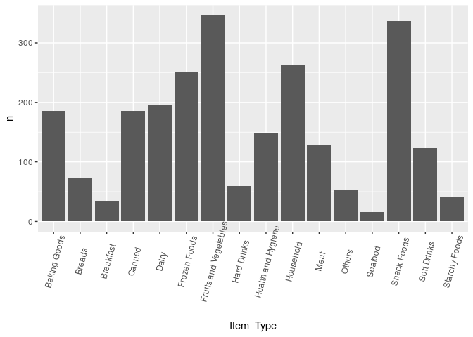

Oh my, so after hours of trying to figure out how to replace all the NAs with the means for that group I came across the answer.

``` r
impute_mean <- function(x) replace(x, is.na(x), mean(x, na.rm = T))

data <- data %>%
    group_by(Item_Type) %>%
    mutate(Item_Weight = impute_mean(Item_Weight))
```

Fixing some inconsistencies with the factors for Item\_Fat\_Content.

``` r
data <- data %>%
    mutate(Item_Fat_Content = replace(Item_Fat_Content, Item_Fat_Content == 'LF', 'Low Fat')) %>%
    mutate(Item_Fat_Content = replace(Item_Fat_Content, Item_Fat_Content == 'low fat', 'Low Fat')) %>%
    mutate(Item_Fat_Content = replace(Item_Fat_Content, Item_Fat_Content == 'reg', 'Regular')) %>%
    droplevels()
```

``` r
ggplot(data, aes(Item_Visibility, Item_Outlet_Sales)) + 
    geom_point(size = 0.75)
```

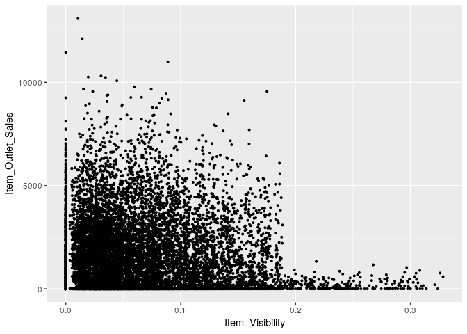

Having an item with zero Item\_Visibility that has sales makes little sense. I'm going to make the assumption that people aren't buying items that are stored in the back of the store. Running with Item\_Outlet\_Sales == 0 yields 0 results, so all the cases of Item\_Visibility are beening bought. We'll set the Item\_Visibilty for equal to the mean of Item\_Visibility.

``` r
data <- data %>%
    group_by(Item_Type) %>%
    mutate(Item_Visibility = replace(Item_Visibility, Item_Visibility == 0, mean(Item_Visibility))) %>%
    mutate(Item_Visibility = as.double(Item_Visibility))

summary(data)
```

    ##  Item_Identifier  Item_Weight     Item_Fat_Content Item_Visibility   
    ##  DRA24  :   10   Min.   : 4.555   Low Fat:9185     Min.   :0.003575  
    ##  DRA59  :   10   1st Qu.: 9.300   Regular:5019     1st Qu.:0.033143  
    ##  DRB25  :   10   Median :12.800                    Median :0.060006  
    ##  DRC25  :   10   Mean   :12.793                    Mean   :0.070028  
    ##  DRC27  :   10   3rd Qu.:16.000                    3rd Qu.:0.094037  
    ##  DRC36  :   10   Max.   :21.350                    Max.   :0.328391  
    ##  (Other):14144                                                       
    ##                  Item_Type       Item_MRP      Outlet_Identifier
    ##  Fruits and Vegetables:2013   Min.   : 31.29   OUT027 :1559     
    ##  Snack Foods          :1989   1st Qu.: 94.01   OUT013 :1553     
    ##  Household            :1548   Median :142.25   OUT035 :1550     
    ##  Frozen Foods         :1426   Mean   :141.00   OUT046 :1550     
    ##  Dairy                :1136   3rd Qu.:185.86   OUT049 :1550     
    ##  Baking Goods         :1086   Max.   :266.89   OUT045 :1548     
    ##  (Other)              :5006                    (Other):4894     
    ##  Outlet_Establishment_Year Outlet_Size   Outlet_Location_Type
    ##  Min.   :1985                    :4016   Tier 1:3980         
    ##  1st Qu.:1987              High  :1553   Tier 2:4641         
    ##  Median :1999              Medium:4655   Tier 3:5583         
    ##  Mean   :1998              Small :3980                       
    ##  3rd Qu.:2004                                                
    ##  Max.   :2009                                                
    ##                                                              
    ##             Outlet_Type   Item_Outlet_Sales
    ##  Grocery Store    :1805   Min.   :    0.0  
    ##  Supermarket Type1:9294   1st Qu.:    0.0  
    ##  Supermarket Type2:1546   Median :  559.3  
    ##  Supermarket Type3:1559   Mean   : 1308.9  
    ##                           3rd Qu.: 2163.2  
    ##                           Max.   :13087.0  
    ## 

Changing year to years since started.

``` r
data <- data %>%
    mutate(Years_Open = 2013 -Outlet_Establishment_Year)
data <- data[, c(1,2,3,4,5,6,7,13,9,10,11,12)]
```

Figuring out what to do with the missing values for the Outlet\_Size is tricky. It represents a pretty large chunk of the instances. Breaking the data down into levels for each predictor gives us a much clear picture of what's going on. You can use Baye's theorem here, but intuition will be enough here.

``` r
data %>%
    group_by(Outlet_Location_Type, Outlet_Type, Outlet_Size) %>%
    count()
```

    ## # A tibble: 9 x 4
    ## # Groups:   Outlet_Location_Type, Outlet_Type, Outlet_Size [9]
    ##   Outlet_Location_Type Outlet_Type       Outlet_Size     n
    ##   <fct>                <fct>             <fct>       <int>
    ## 1 Tier 1               Grocery Store     Small         880
    ## 2 Tier 1               Supermarket Type1 Medium       1550
    ## 3 Tier 1               Supermarket Type1 Small        1550
    ## 4 Tier 2               Supermarket Type1 ""           3091
    ## 5 Tier 2               Supermarket Type1 Small        1550
    ## 6 Tier 3               Grocery Store     ""            925
    ## 7 Tier 3               Supermarket Type1 High         1553
    ## 8 Tier 3               Supermarket Type2 Medium       1546
    ## 9 Tier 3               Supermarket Type3 Medium       1559

A visualization of Outlet\_Type and Outlet\_Size. It looks like blank Outlet\_Size that are Outlet\_Location\_Type = Tier 2 are going to be small, with further evidence from that both are Supermarket Type1.

``` r
ggplot(data, aes(Outlet_Size, Outlet_Location_Type, color=Outlet_Type)) +
    geom_point()
```

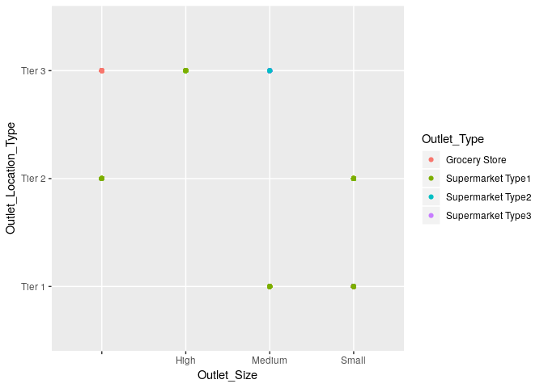

Fixing the blank Outlet\_Size. Output verifies that it worked, we no longer have any blank values.

``` r
data <- data %>%
    mutate(Outlet_Size = replace(Outlet_Size, Outlet_Size == '' & Outlet_Location_Type == 'Tier 2', 'Small')) %>%
    mutate(Outlet_Size = replace(Outlet_Size, Outlet_Size == '' & Outlet_Location_Type == 'Tier 3', 'Medium'))

sapply(data, function(x) sum(x == ''))
```

    ##      Item_Identifier          Item_Weight     Item_Fat_Content 
    ##                    0                    0                    0 
    ##      Item_Visibility            Item_Type             Item_MRP 
    ##                    0                    0                    0 
    ##    Outlet_Identifier           Years_Open          Outlet_Size 
    ##                    0                    0                    0 
    ## Outlet_Location_Type          Outlet_Type    Item_Outlet_Sales 
    ##                    0                    0                    0

Possible to condense the Item\_Type down into 3 categories; FD-Food, NC-Non-Consumable, DR:Drink. However I'll hold off on this and see how well the model does. I'm not quite sure how necessary this is.

``` r
data <- data %>%
    separate(Item_Identifier, c('Item_Category', 'Item_Identifier'), sep=2)
data$Item_Category = as.factor(data$Item_Category)
```

3. EDA
------

``` r
sapply(data, function(x) n_distinct(x))
```

    ##        Item_Category      Item_Identifier          Item_Weight 
    ##                    3                 1559                  431 
    ##     Item_Fat_Content      Item_Visibility            Item_Type 
    ##                    2                13021                   16 
    ##             Item_MRP    Outlet_Identifier           Years_Open 
    ##                 8052                   10                    9 
    ##          Outlet_Size Outlet_Location_Type          Outlet_Type 
    ##                    3                    3                    4 
    ##    Item_Outlet_Sales 
    ##                 3494

``` r
summary(data)
```

    ##  Item_Category Item_Identifier     Item_Weight     Item_Fat_Content
    ##  DR: 1317      Length:14204       Min.   : 4.555   Low Fat:9185    
    ##  FD:10201      Class :character   1st Qu.: 9.300   Regular:5019    
    ##  NC: 2686      Mode  :character   Median :12.800                   
    ##                                   Mean   :12.793                   
    ##                                   3rd Qu.:16.000                   
    ##                                   Max.   :21.350                   
    ##                                                                    
    ##  Item_Visibility                    Item_Type       Item_MRP     
    ##  Min.   :0.003575   Fruits and Vegetables:2013   Min.   : 31.29  
    ##  1st Qu.:0.033143   Snack Foods          :1989   1st Qu.: 94.01  
    ##  Median :0.060006   Household            :1548   Median :142.25  
    ##  Mean   :0.070028   Frozen Foods         :1426   Mean   :141.00  
    ##  3rd Qu.:0.094037   Dairy                :1136   3rd Qu.:185.86  
    ##  Max.   :0.328391   Baking Goods         :1086   Max.   :266.89  
    ##                     (Other)              :5006                   
    ##  Outlet_Identifier   Years_Open    Outlet_Size   Outlet_Location_Type
    ##  OUT027 :1559      Min.   : 4.00         :   0   Tier 1:3980         
    ##  OUT013 :1553      1st Qu.: 9.00   High  :1553   Tier 2:4641         
    ##  OUT035 :1550      Median :14.00   Medium:5580   Tier 3:5583         
    ##  OUT046 :1550      Mean   :15.17   Small :7071                       
    ##  OUT049 :1550      3rd Qu.:26.00                                     
    ##  OUT045 :1548      Max.   :28.00                                     
    ##  (Other):4894                                                        
    ##             Outlet_Type   Item_Outlet_Sales
    ##  Grocery Store    :1805   Min.   :    0.0  
    ##  Supermarket Type1:9294   1st Qu.:    0.0  
    ##  Supermarket Type2:1546   Median :  559.3  
    ##  Supermarket Type3:1559   Mean   : 1308.9  
    ##                           3rd Qu.: 2163.2  
    ##                           Max.   :13087.0  
    ## 

``` r
ggplot(data, aes(Item_Type, Item_Outlet_Sales)) +
    geom_bar(stat='identity') +
    theme(axis.text.x = element_text(angle=60, vjust=0.75))
```

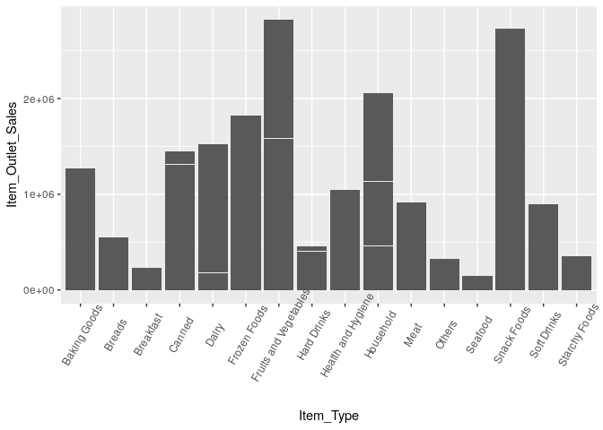

Are certain Item\_Type given more visibilty than others? No clear connection

``` r
ggplot(data, aes(Item_Type, Item_Visibility)) +
    geom_boxplot() +
    theme(axis.text.x = element_text(angle=90, vjust=0.8))
```

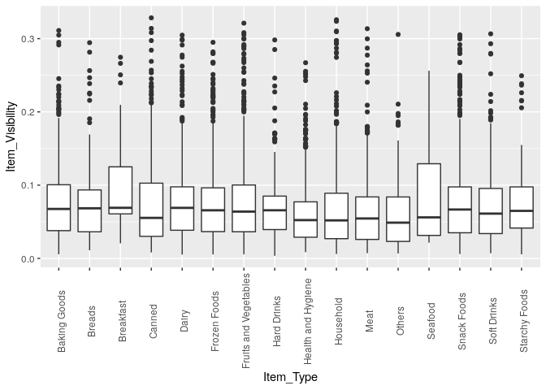

``` r
ggplot(train, aes(Item_Visibility, Item_Outlet_Sales, color = Item_Type)) + 
    geom_point(size = 0.75)
```

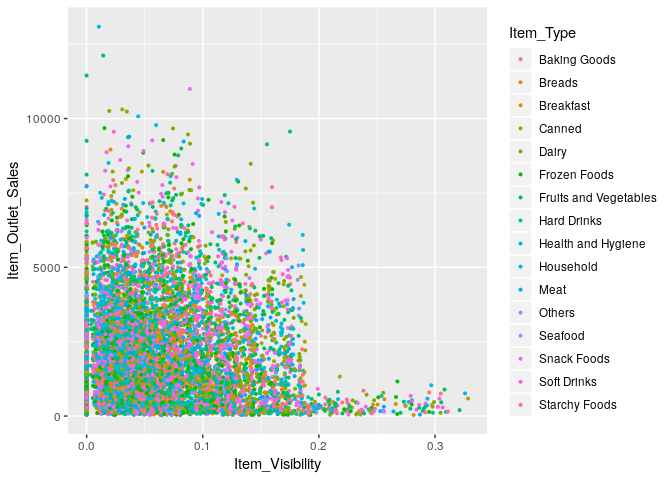

4. Model
--------

``` r
mse <- function(x, y) {
    mean((x - y)^2)
}
```

Creating the train/test split again

``` r
set.seed(1)
train <- data[1:8523,]
train_reg <- train

train_samp <- sample(1:nrow(train), nrow(train)*0.7)


test <- train[-train_samp,]
test <- test[,-c(2)]

train <- train[train_samp,]
train <- train[,-c(2)]

real_test <- data[8524:nrow(data),]
```

Baseline model

``` r
mean_sales <- mean(train$Item_Outlet_Sales)

base1 <- tibble(test$Outlet_Identifier, 'Item_Outlet_Sales' = mean_sales)

mse_base1 <- mse(base1[,2], test[,12])
cat('MSE of baseline model:', mse_base1)
```

    ## MSE of baseline model: 2987332

Baseline linear model

``` r
store_lm <- lm(Item_Outlet_Sales~., train)

summary(store_lm)
```

    ## 
    ## Call:
    ## lm(formula = Item_Outlet_Sales ~ ., data = train)
    ## 
    ## Residuals:
    ##     Min      1Q  Median      3Q     Max 
    ## -3849.1  -672.9   -92.4   575.9  7982.8 
    ## 
    ## Coefficients: (9 not defined because of singularities)
    ##                                  Estimate Std. Error t value Pr(>|t|)    
    ## (Intercept)                    -1925.8078   164.4646 -11.710   <2e-16 ***
    ## Item_CategoryFD                   96.1950   134.7652   0.714    0.475    
    ## Item_CategoryNC                   42.5554   177.8211   0.239    0.811    
    ## Item_Weight                        0.5157     3.4626   0.149    0.882    
    ## Item_Fat_ContentRegular           14.4186    34.0976   0.423    0.672    
    ## Item_Visibility                 -284.1550   318.2388  -0.893    0.372    
    ## Item_TypeBreads                   47.1754   101.3015   0.466    0.641    
    ## Item_TypeBreakfast               101.9157   133.8659   0.761    0.446    
    ## Item_TypeCanned                   96.0957    76.2329   1.261    0.208    
    ## Item_TypeDairy                    16.0745    79.0308   0.203    0.839    
    ## Item_TypeFrozen Foods             29.2402    71.3965   0.410    0.682    
    ## Item_TypeFruits and Vegetables    97.1499    66.7799   1.455    0.146    
    ## Item_TypeHard Drinks             205.5757   170.7961   1.204    0.229    
    ## Item_TypeHealth and Hygiene       89.0587   119.3615   0.746    0.456    
    ## Item_TypeHousehold                48.9994   112.5362   0.435    0.663    
    ## Item_TypeMeat                     48.4138    87.4636   0.554    0.580    
    ## Item_TypeOthers                        NA         NA      NA       NA    
    ## Item_TypeSeafood                 174.3473   173.0454   1.008    0.314    
    ## Item_TypeSnack Foods              44.5508    66.7744   0.667    0.505    
    ## Item_TypeSoft Drinks             123.5130   157.8998   0.782    0.434    
    ## Item_TypeStarchy Foods            43.6422   127.3466   0.343    0.732    
    ## Item_MRP                          15.5030     0.2355  65.831   <2e-16 ***
    ## Outlet_IdentifierOUT013         1877.9817    74.1949  25.311   <2e-16 ***
    ## Outlet_IdentifierOUT017         1953.9756    73.9193  26.434   <2e-16 ***
    ## Outlet_IdentifierOUT018         1539.2921    74.3195  20.712   <2e-16 ***
    ## Outlet_IdentifierOUT019          -77.4965    83.3281  -0.930    0.352    
    ## Outlet_IdentifierOUT027         3291.4242    74.1328  44.399   <2e-16 ***
    ## Outlet_IdentifierOUT035         2002.3716    74.3433  26.934   <2e-16 ***
    ## Outlet_IdentifierOUT045         1803.5092    73.9610  24.385   <2e-16 ***
    ## Outlet_IdentifierOUT046         1875.4181    73.8637  25.390   <2e-16 ***
    ## Outlet_IdentifierOUT049         1934.9574    73.6810  26.261   <2e-16 ***
    ## Years_Open                             NA         NA      NA       NA    
    ## Outlet_SizeMedium                      NA         NA      NA       NA    
    ## Outlet_SizeSmall                       NA         NA      NA       NA    
    ## Outlet_Location_TypeTier 2             NA         NA      NA       NA    
    ## Outlet_Location_TypeTier 3             NA         NA      NA       NA    
    ## Outlet_TypeSupermarket Type1           NA         NA      NA       NA    
    ## Outlet_TypeSupermarket Type2           NA         NA      NA       NA    
    ## Outlet_TypeSupermarket Type3           NA         NA      NA       NA    
    ## ---
    ## Signif. codes:  0 '***' 0.001 '**' 0.01 '*' 0.05 '.' 0.1 ' ' 1
    ## 
    ## Residual standard error: 1125 on 5936 degrees of freedom
    ## Multiple R-squared:  0.5624, Adjusted R-squared:  0.5603 
    ## F-statistic: 263.1 on 29 and 5936 DF,  p-value: < 2.2e-16

``` r
plot(store_lm)
```

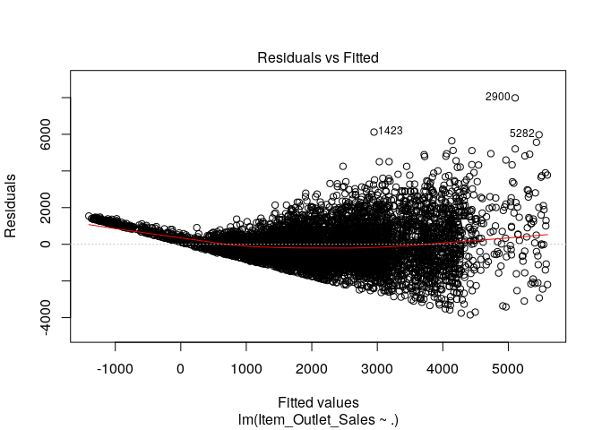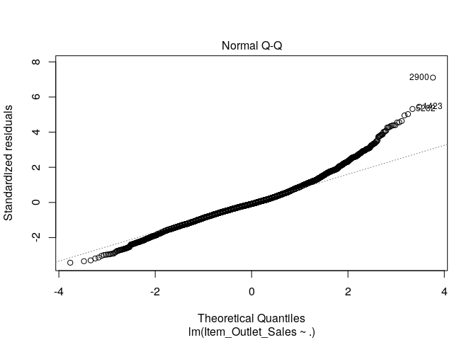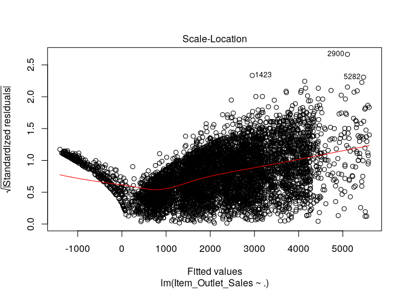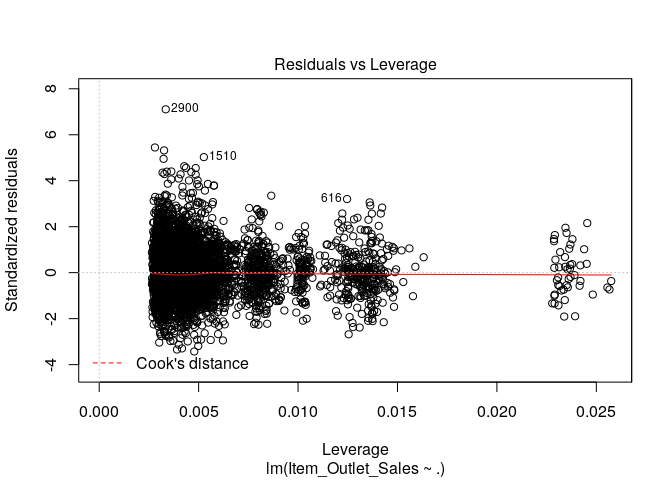

The linear model preforms far worse than the baseline model, meaning that it's identifying the incorrect parameters.

``` r
lm_pred <- predict(store_lm, newx=test)

mse_lm <- mse(lm_pred, test[,12])
cat('Linear model MSE: ', mse_lm)
```

    ## Linear model MSE:  4551549

Things I learned: lm to some extent fitlers out highly correlated predictors. If I ran years\_open and Outlet\_Estblishment\_year at the same time, Years\_Open would become NA because signularities.

``` r
store_rf <- randomForest(Item_Outlet_Sales~., train, mtry=3, importance=T)
store_rf
```

    ## 
    ## Call:
    ##  randomForest(formula = Item_Outlet_Sales ~ ., data = train, mtry = 3,      importance = T) 
    ##                Type of random forest: regression
    ##                      Number of trees: 500
    ## No. of variables tried at each split: 3
    ## 
    ##           Mean of squared residuals: 1225125
    ##                     % Var explained: 57.45

``` r
pred_rf <- predict(store_rf, newdata=test)
mse(pred_rf, test[,12])
```

    ## [1] 1230869

``` r
importance(store_rf)
```

    ##                         %IncMSE IncNodePurity
    ## Item_Category          1.830013     127718938
    ## Item_Weight           11.391186     935413180
    ## Item_Fat_Content       5.762569     132131128
    ## Item_Visibility        6.611735    1197894656
    ## Item_Type              2.341819     866681678
    ## Item_MRP             181.718939    6519740741
    ## Outlet_Identifier     25.831271    1966613921
    ## Years_Open            18.019061     674360661
    ## Outlet_Size            7.960769     160913867
    ## Outlet_Location_Type  10.116172     159368782
    ## Outlet_Type           26.634317    1697783780

``` r
which.min(store_rf$mse)
```

    ## [1] 500

``` r
sqrt(store_rf$mse[which.min(store_rf$mse)])
```

    ## [1] 1106.854

Tuning RF for the mtry parameter. Results are that 3 is the best and the process stops at mtry=6, meaning the more complex trees preform worse than less complex trees.

``` r
x1 <- train[,-12]

m1 <- tuneRF(
    x = x1,
    y = train$Item_Outlet_Sales,
    ntreeTry = 250,
    mtryStart = 4,
    stepFactor = 1.5,
    improve = 0.01
)
```

    ## mtry = 4  OOB error = 1253486 
    ## Searching left ...
    ## mtry = 3     OOB error = 1236610 
    ## 0.01346329 0.01 
    ## mtry = 2     OOB error = 1286457 
    ## -0.04030933 0.01 
    ## Searching right ...
    ## mtry = 6     OOB error = 1277679 
    ## -0.0332107 0.01

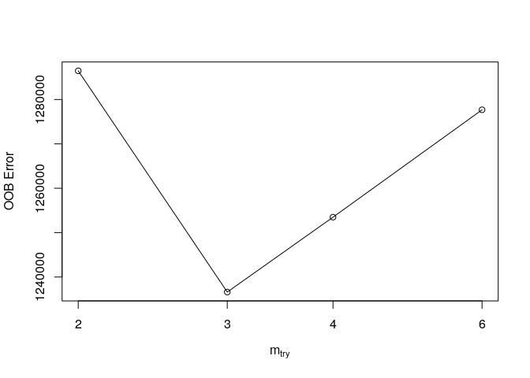

``` r
feat_imp <- store_rf %>%
    importance(type=1) %>%
    as.tibble() %>%
    rename(Inc_MSE= '%IncMSE') %>%
    mutate(Feature = rownames(importance(store_rf))) %>%
    select(Feature, Inc_MSE) %>%
    mutate(relative_imp = Inc_MSE/sum(Inc_MSE)) %>%
    mutate(Feature = factor(Feature, levels=Feature[order(Inc_MSE)]))


ggplot(feat_imp, aes(Feature, relative_imp)) +
    geom_bar(stat='identity', fill='#56B4E9') +
    coord_flip() +
    ylab('Relative importance') +
    ggtitle('Relative importance of features from Random Forest model')
```

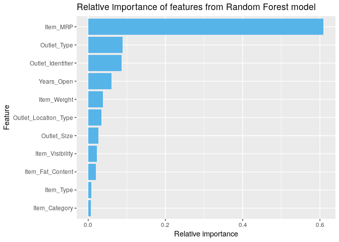

``` r
total_sales <- data %>%
    group_by(Outlet_Identifier) %>%
    summarise(Total_Sales = sum(Item_Outlet_Sales))

ggplot(total_sales, aes(Outlet_Identifier, Total_Sales)) +
    geom_bar(stat='identity', fill='#56B4E9') +
    ggtitle('Total sales per outlet') +
    ylab('Total sales ($)') +
    xlab('Outlet identifier') +
    geom_text(aes(label=ifelse(Total_Sales==max(Total_Sales), as.integer(Total_Sales), '')), hjust=0.5, vjust=-0.25) +
    geom_text(aes(label=ifelse(Total_Sales==min(Total_Sales), as.integer(Total_Sales), '')), hjust=0.5, vjust=-0.25) +
    scale_y_continuous(labels=dollar, limits=c(0, 4000000)) +
    theme(panel.grid.major = element_line(color = 'gray85'))
```

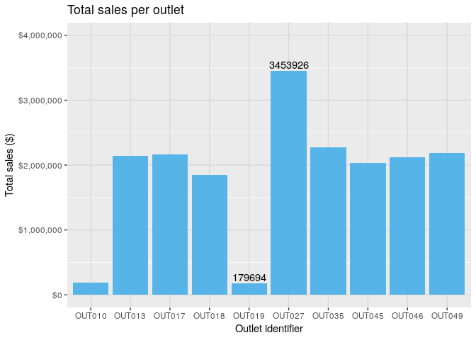

Item\_Fat\_Content, no difference

``` r
ggplot(data, aes(Item_Fat_Content, Item_Outlet_Sales)) +
    geom_boxplot()
```

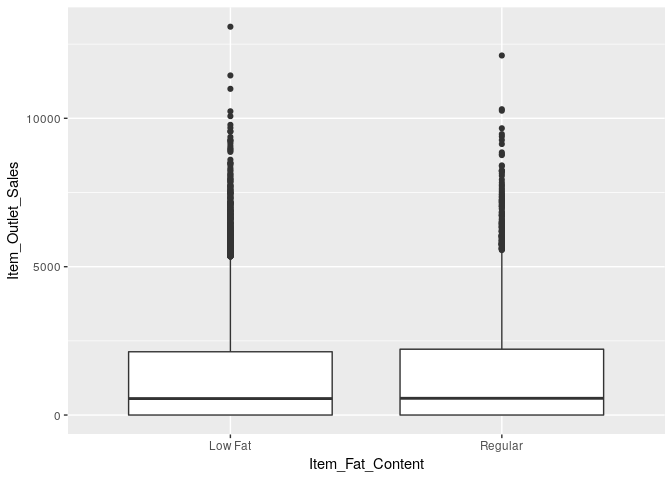

``` r
total <- train_reg %>% group_by(Outlet_Type) %>%
    summarise(total_sales = sum(Item_Outlet_Sales))

avg <- train_reg %>% group_by(Outlet_Type) %>%
    summarise(avg_sales = mean(Item_Outlet_Sales))

num <- train_reg %>% group_by(Outlet_Type) %>%
    tally()

store_normalizer <- c(2,6,1,1)
outlet_sales <- merge(total, avg, by='Outlet_Type') %>%
    merge(num, by='Outlet_Type') %>%
    mutate(avg_sales = avg_sales/store_normalizer) %>%
    mutate(n = n/store_normalizer)
outlet_sales
```

    ##         Outlet_Type total_sales avg_sales     n
    ## 1     Grocery Store    368034.3  169.9143 541.5
    ## 2 Supermarket Type1  12917342.3  386.0302 929.5
    ## 3 Supermarket Type2   1851822.8 1995.4987 928.0
    ## 4 Supermarket Type3   3453926.1 3694.0386 935.0

Best stores (sum sales for each outlet id)

To do:

Rerun with important features. Graph features against each other: Years vs outlet Types of stores
