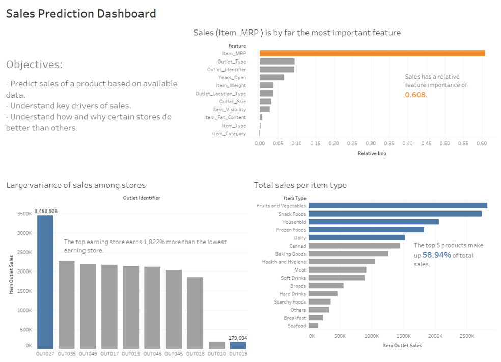

I used pricing and location to predict prices of items for a fictional chain of grocery stores. A report and a Tableau dashboard were also created to summarize the process and key findings.

# Products 

### Report
The report is the basis of this analysis, summarizing my motivations for this project and going 
to into detail about the key findings. It also shows the R code alongside rationales for why each 
bit of code was used. It concludes with possible next steps for the company, both for the analysis 
and business steps.

### Dashboard
I created a [Tableau dashboard](https://public.tableau.com/profile/christopher.chan7070#!/vizhome/bigmat_sales/bigmart_sales) that summarizes the key findings. The dashboard lays out the relevant information in a clean
and concise manner. Even though the analysis used some sophisticated  techniques the dashboard's 
audience doesn't need to immediately know how the results were achieved. The techniques and 
technologies used are summarized in the report.
