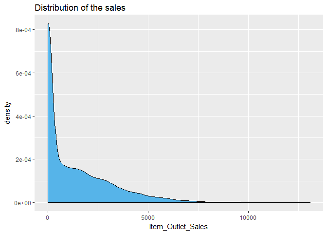

BigMart Sales Regression
================
Christoper Chan
February 4, 2019

``` r
library(tidyverse)
library(randomForest)
library(scales)
library(here)
```

To see all the code of this project go to: [Full](https://github.com/chriscross00/projects/blob/master/bigmart_sales/alts/full_project.md)

BigMart is a fictional chain of grocery stores that sells a variety of products, from household supplies to alcohol. Like many other fields BigMart wants to predict the sale of a product. The matter is more pressing because many products have a short shelf life, meaning that the company can potential lose thousands of dollars if they buy the wrong produt. Therefore, our goal is to use data about the products and about each store to predict the future sale of a product.

In order to understand the interactions within this data a multiple step process took place. In this report I'll go through a 5 step process:

-   Processing the data
-   Feature engineering
-   Exploratory data analysis
-   Model building
-   Analysis

As I went through this process a key question was determining which features are the best predictors of sales. That way BigMart can replicate those features across all their stores, increasing profits. Picking a model that preforms feature selection was a important aspect of this project.

Below are the key findings from this analysis. The full information about each bullet point can be found in the Analysis section of this report. Conclusions:

-   Item\_MRP (price) is by far the strongest predictor of Item\_Outlet\_Sales (sales).
-   The next best predictors of sales are all related to the outlet. Outlet\_Type (with major caveats), Outlet\_Identifier, and Years\_Open all predict sales reasonably well.
-   Fruits and Vegetables and Snack Foods have the highest sales at $5,552,846 and represent 30% of the total sales. Item\_Types such as Breakfast and Seafood have the worst total sales and account for only 2% of our total profits.
-   The reasons why certain stores do better than others is beyond the scope of this dataset, I simply do not have the data to investigate.

1 Read and clean data
---------------------

Because the dataset is relatively small I can read it all into the R. I combined both the training and test dataset to ensure I got a complete picture of the data.

``` r
here('bigmart_sales')
train <- read.csv('data/Train.csv')
test <- read.csv('data/Test.csv')
```

The summary function gives us a quick look at the type of data I are working with and where I need to clean.

``` r
head(train)
```

    ##   Item_Identifier Item_Weight Item_Fat_Content Item_Visibility
    ## 1           FDA15       9.300          Low Fat      0.01604730
    ## 2           DRC01       5.920          Regular      0.01927822
    ## 3           FDN15      17.500          Low Fat      0.01676007
    ## 4           FDX07      19.200          Regular      0.00000000
    ## 5           NCD19       8.930          Low Fat      0.00000000
    ## 6           FDP36      10.395          Regular      0.00000000
    ##               Item_Type Item_MRP Outlet_Identifier
    ## 1                 Dairy 249.8092            OUT049
    ## 2           Soft Drinks  48.2692            OUT018
    ## 3                  Meat 141.6180            OUT049
    ## 4 Fruits and Vegetables 182.0950            OUT010
    ## 5             Household  53.8614            OUT013
    ## 6          Baking Goods  51.4008            OUT018
    ##   Outlet_Establishment_Year Outlet_Size Outlet_Location_Type
    ## 1                      1999      Medium               Tier 1
    ## 2                      2009      Medium               Tier 3
    ## 3                      1999      Medium               Tier 1
    ## 4                      1998                           Tier 3
    ## 5                      1987        High               Tier 3
    ## 6                      2009      Medium               Tier 3
    ##         Outlet_Type Item_Outlet_Sales
    ## 1 Supermarket Type1         3735.1380
    ## 2 Supermarket Type2          443.4228
    ## 3 Supermarket Type1         2097.2700
    ## 4     Grocery Store          732.3800
    ## 5 Supermarket Type1          994.7052
    ## 6 Supermarket Type2          556.6088

``` r
test <- mutate(test, Item_Outlet_Sales = 0)

data <- rbind(train, test)
summary(data)
```

    ##  Item_Identifier  Item_Weight     Item_Fat_Content Item_Visibility  
    ##  DRA24  :   10   Min.   : 4.555   LF     : 522     Min.   :0.00000  
    ##  DRA59  :   10   1st Qu.: 8.710   low fat: 178     1st Qu.:0.02704  
    ##  DRB25  :   10   Median :12.600   Low Fat:8485     Median :0.05402  
    ##  DRC25  :   10   Mean   :12.793   reg    : 195     Mean   :0.06595  
    ##  DRC27  :   10   3rd Qu.:16.750   Regular:4824     3rd Qu.:0.09404  
    ##  DRC36  :   10   Max.   :21.350                    Max.   :0.32839  
    ##  (Other):14144   NA's   :2439                                       
    ##                  Item_Type       Item_MRP      Outlet_Identifier
    ##  Fruits and Vegetables:2013   Min.   : 31.29   OUT027 :1559     
    ##  Snack Foods          :1989   1st Qu.: 94.01   OUT013 :1553     
    ##  Household            :1548   Median :142.25   OUT035 :1550     
    ##  Frozen Foods         :1426   Mean   :141.00   OUT046 :1550     
    ##  Dairy                :1136   3rd Qu.:185.86   OUT049 :1550     
    ##  Baking Goods         :1086   Max.   :266.89   OUT045 :1548     
    ##  (Other)              :5006                    (Other):4894     
    ##  Outlet_Establishment_Year Outlet_Size   Outlet_Location_Type
    ##  Min.   :1985                    :4016   Tier 1:3980         
    ##  1st Qu.:1987              High  :1553   Tier 2:4641         
    ##  Median :1999              Medium:4655   Tier 3:5583         
    ##  Mean   :1998              Small :3980                       
    ##  3rd Qu.:2004                                                
    ##  Max.   :2009                                                
    ##                                                              
    ##             Outlet_Type   Item_Outlet_Sales
    ##  Grocery Store    :1805   Min.   :    0.0  
    ##  Supermarket Type1:9294   1st Qu.:    0.0  
    ##  Supermarket Type2:1546   Median :  559.3  
    ##  Supermarket Type3:1559   Mean   : 1308.9  
    ##                           3rd Qu.: 2163.2  
    ##                           Max.   :13087.0  
    ## 

2 Feature Engineering/Cleaning
------------------------------

Almost all of the features had to be engineered or cleaned in some capacity. Each chunk of code is a seperate feature being altered, this breaks the feature engineering up and keeps the code modular. Features are cleaned in order, from left to right.

``` r
data <- data %>%
    separate(Item_Identifier, c('Item_Category', 'Item_Identifier'), sep=2)
data$Item_Category = as.factor(data$Item_Category)
```

``` r
impute_mean <- function(x) replace(x, is.na(x), mean(x, na.rm = T))

data <- data %>%
    group_by(Item_Type) %>%
    mutate(Item_Weight = impute_mean(Item_Weight))
```

``` r
data <- data %>%
    mutate(Item_Fat_Content = replace(Item_Fat_Content, Item_Fat_Content == 'LF', 'Low Fat')) %>%
    mutate(Item_Fat_Content = replace(Item_Fat_Content, Item_Fat_Content == 'low fat', 'Low Fat')) %>%
    mutate(Item_Fat_Content = replace(Item_Fat_Content, Item_Fat_Content == 'reg', 'Regular')) %>%
    droplevels()
```

``` r
data <- data %>%
    group_by(Item_Type) %>%
    mutate(Item_Visibility = replace(Item_Visibility, Item_Visibility == 0, mean(Item_Visibility))) %>%
    mutate(Item_Visibility = as.double(Item_Visibility))
```

``` r
data <- data %>%
    mutate(Years_Open = 2013 -Outlet_Establishment_Year)
data <- data[, c(1,2,3,4,5,6,7,14,8,10,11,12,13)]
```

``` r
data <- data %>%
    mutate(Outlet_Size = replace(Outlet_Size, Outlet_Size == '' & Outlet_Location_Type == 'Tier 2', 'Small')) %>%
    mutate(Outlet_Size = replace(Outlet_Size, Outlet_Size == '' & Outlet_Location_Type == 'Tier 3', 'Medium'))
```

Some highlights of the data processing:

-   Items with missing weights were replaced with their respective Item\_Type's mean.
-   Item\_Fat\_Content was standardized.
-   Items with zero Item\_Visibility made no sense, how could customers buy something they don't know exist in the store. Item\_Visibility was set to the mean Item\_Visbility of that Item\_Type because in theory Item\_Types are grouped together in store, ie all the peanut butter is paced next to each other yielding relatively similar Item\_Visbility.

3 EDA
-----

For the full EDA please see the linked full code. The graphs presented below are the most interesting.

``` r
sapply(data, function(x) n_distinct(x))
```

    ##        Item_Category      Item_Identifier          Item_Weight 
    ##                    3                 1559                  431 
    ##     Item_Fat_Content      Item_Visibility            Item_Type 
    ##                    2                13021                   16 
    ##             Item_MRP           Years_Open    Outlet_Identifier 
    ##                 8052                    9                   10 
    ##          Outlet_Size Outlet_Location_Type          Outlet_Type 
    ##                    3                    3                    4 
    ##    Item_Outlet_Sales 
    ##                 3494

``` r
summary(data)
```

    ##  Item_Category Item_Identifier     Item_Weight     Item_Fat_Content
    ##  DR: 1317      Length:14204       Min.   : 4.555   Low Fat:9185    
    ##  FD:10201      Class :character   1st Qu.: 9.300   Regular:5019    
    ##  NC: 2686      Mode  :character   Median :12.800                   
    ##                                   Mean   :12.793                   
    ##                                   3rd Qu.:16.000                   
    ##                                   Max.   :21.350                   
    ##                                                                    
    ##  Item_Visibility                    Item_Type       Item_MRP     
    ##  Min.   :0.003575   Fruits and Vegetables:2013   Min.   : 31.29  
    ##  1st Qu.:0.033143   Snack Foods          :1989   1st Qu.: 94.01  
    ##  Median :0.060006   Household            :1548   Median :142.25  
    ##  Mean   :0.070028   Frozen Foods         :1426   Mean   :141.00  
    ##  3rd Qu.:0.094037   Dairy                :1136   3rd Qu.:185.86  
    ##  Max.   :0.328391   Baking Goods         :1086   Max.   :266.89  
    ##                     (Other)              :5006                   
    ##    Years_Open    Outlet_Identifier Outlet_Size   Outlet_Location_Type
    ##  Min.   : 4.00   OUT027 :1559            :   0   Tier 1:3980         
    ##  1st Qu.: 9.00   OUT013 :1553      High  :1553   Tier 2:4641         
    ##  Median :14.00   OUT035 :1550      Medium:5580   Tier 3:5583         
    ##  Mean   :15.17   OUT046 :1550      Small :7071                       
    ##  3rd Qu.:26.00   OUT049 :1550                                        
    ##  Max.   :28.00   OUT045 :1548                                        
    ##                  (Other):4894                                        
    ##             Outlet_Type   Item_Outlet_Sales
    ##  Grocery Store    :1805   Min.   :    0.0  
    ##  Supermarket Type1:9294   1st Qu.:    0.0  
    ##  Supermarket Type2:1546   Median :  559.3  
    ##  Supermarket Type3:1559   Mean   : 1308.9  
    ##                           3rd Qu.: 2163.2  
    ##                           Max.   :13087.0  
    ## 

Are certain Item\_Type given more visibilty than others? The boxplot shows no clear connection.

``` r
ggplot(data, aes(Item_Type, Item_Visibility)) +
    geom_boxplot() +
    theme(axis.text.x = element_text(angle=90, vjust=0.8)) + 
    xlab('Item type') +
    ylab('Item visibility') + 
    ggtitle('Item visibility by item type')
```


Graphing Item\_Visibility against Item\_Outlet\_Sales explores if there is a realtionship between how visible an item is and it's sales. A hypothesis could be that items that are more visible have higher sales than items that are less visible. However, looking at the graph no relationship is apparent.

``` r
ggplot(data, aes(Item_Visibility, Item_Outlet_Sales, color = Item_Category)) + 
    geom_point(size = 0.75) +
    xlab('Item visibility') +
    ylab('Sales') + 
    ggtitle('Item sales vs visibility labeled by category')
```


Because our response variable is not normally distributed, it is skewed highly right skewed, a key assumption of linear regression is violated, that the response variable is normally distributed. In the context of a grocery store a highly right skewed Item\_Outlet\_Sales distribution makes sense: people aren't all buying one product, instead a variety of products are being sold at relatively low quantities.

Instead of a linear model I'll run a random forest model which doesn't carry all the assumptions of linear regression. Several reasons for chosing a random forest model over other algorithms is that it can do regression, I didn't need to scale or normalize any of the features, and finally, and in this case most importantly, I can extract the most important features.

``` r
ggplot(data, aes(Item_Outlet_Sales)) + 
    geom_density(fill='#56B4E9') +
    ggtitle('Distribution of the sales')
```



4 Model building
----------------

I constructed a baseline model to see if the more advanced models I create are worth the effort. The baseline model takes the mean of the Item\_Outlet\_Sales as the predicted sales of each item.

``` r
mean_sales <- mean(train$Item_Outlet_Sales)

base1 <- tibble(test$Outlet_Identifier, 'Item_Outlet_Sales' = mean_sales)

mse_base1 <- mse(base1[,2], test[,12])
cat('MSE of baseline model:', mse_base1)
```

    ## MSE of baseline model: 2987332

Finally, I ran a random forest model. It preforms far better than the baseline model.

``` r
store_rf <- randomForest(Item_Outlet_Sales~., train, mtry=3, importance=T)
store_rf
```

    ## 
    ## Call:
    ##  randomForest(formula = Item_Outlet_Sales ~ ., data = train, mtry = 3,      importance = T) 
    ##                Type of random forest: regression
    ##                      Number of trees: 500
    ## No. of variables tried at each split: 3
    ## 
    ##           Mean of squared residuals: 1234760
    ##                     % Var explained: 57.12

``` r
pred_rf <- predict(store_rf, newdata=test)
cat('MSE of the random forest model:', mse(pred_rf, test[,12]))
```

    ## MSE of the random forest model: 1231573

The graph of relative feature importance tells us what features are the best predictors of Item\_Outlet\_Sales. Item\_MRP is by far the greatest predictor of sales while Outlet\_Type, Outlet\_Identifier, and Years\_Open are also good predictors.

``` r
feat_imp <- store_rf %>%
    importance(type=1) %>%
    as.tibble() %>%
    rename(Inc_MSE= '%IncMSE') %>%
    mutate(Feature = rownames(importance(store_rf))) %>%
    select(Feature, Inc_MSE) %>%
    mutate(relative_imp = Inc_MSE/sum(Inc_MSE)) %>%
    mutate(Feature = factor(Feature, levels=Feature[order(Inc_MSE)]))


ggplot(feat_imp, aes(Feature, relative_imp)) +
    geom_bar(stat='identity', fill='#56B4E9') +
    coord_flip() +
    ylab('Relative importance') +
    ggtitle('Relative importance of features from Random Forest model')
```

 \#\# 5 Analysis

Some outlets do much better than other outlets. The maximum sales and minimum sales are labelled below. Most of the outlets have a total sales of around $2,000,000.

``` r
total_sales <- data %>%
    group_by(Outlet_Identifier, Years_Open) %>%
    summarise(Total_Sales = sum(Item_Outlet_Sales))

ggplot(total_sales, aes(Outlet_Identifier, Total_Sales)) +
    geom_bar(stat='identity', fill='#56B4E9') +
    ggtitle('Total sales per outlet') +
    ylab('Total sales ($)') +
    xlab('Outlet identifier') +
    geom_text(aes(label=ifelse(Total_Sales==max(Total_Sales), as.integer(Total_Sales), '')), hjust=0.5, vjust=-0.25) +
    geom_text(aes(label=ifelse(Total_Sales==min(Total_Sales), as.integer(Total_Sales), '')), hjust=0.5, vjust=-0.25) +
    scale_y_continuous(labels=dollar, limits=c(0, 4000000)) +
    theme(panel.grid.major = element_line(color = 'gray85'))
```


While Outlet\_Type is the second strongest predictor of price, the results may be skewed. I don't have a even distribution of Outlet\_Types, I have 2 Grocery Stores, 6 Type1, 1 Type2 and 1 Type3 Supermarkets. I don't know if these sales numbers are accurate across the board for each Outlet\_Type or if the Grocery Store, Typ2 and Type3 Supermarkets represent a outlier. Therefore, Outlet\_Type should be used with caution as a predictor of sales. A much better predictor is Outlet\_Identifier, though it lacks some of the generalization power.

``` r
data %>% 
    group_by(Outlet_Type, Outlet_Identifier) %>%
    tally()
```

    ## # A tibble: 10 x 3
    ## # Groups:   Outlet_Type [?]
    ##    Outlet_Type       Outlet_Identifier     n
    ##    <fct>             <fct>             <int>
    ##  1 Grocery Store     OUT010              925
    ##  2 Grocery Store     OUT019              880
    ##  3 Supermarket Type1 OUT013             1553
    ##  4 Supermarket Type1 OUT017             1543
    ##  5 Supermarket Type1 OUT035             1550
    ##  6 Supermarket Type1 OUT045             1548
    ##  7 Supermarket Type1 OUT046             1550
    ##  8 Supermarket Type1 OUT049             1550
    ##  9 Supermarket Type2 OUT018             1546
    ## 10 Supermarket Type3 OUT027             1559

``` r
total <- train_reg %>% group_by(Outlet_Type) %>%
    summarise(total_sales = sum(Item_Outlet_Sales))

avg <- train_reg %>% group_by(Outlet_Type) %>%
    summarise(avg_sales = mean(Item_Outlet_Sales))

num <- train_reg %>% group_by(Outlet_Type) %>%
    tally()

store_normalizer <- c(2,6,1,1)
outlet_sales <- merge(total, avg, by='Outlet_Type') %>%
    merge(num, by='Outlet_Type') %>%
    mutate(avg_sales = avg_sales/store_normalizer) %>%
    mutate(n = n/store_normalizer)
outlet_sales
```

    ##         Outlet_Type total_sales avg_sales     n
    ## 1     Grocery Store    368034.3  169.9143 541.5
    ## 2 Supermarket Type1  12917342.3  386.0302 929.5
    ## 3 Supermarket Type2   1851822.8 1995.4987 928.0
    ## 4 Supermarket Type3   3453926.1 3694.0386 935.0

Looking at the items, Fruits and Vegetables and Snack Foods have the highest sales. Together just those two item types bring in $5,552,846 and represent 30% of the total sales across all stores. Item\_Types such as Breakfast and Seafood have the worst total sales and account for only 2% of our total profits.

With two types of items, Fruits and Vegetables and Snack Foods, accounting for 30% of the total sales it is essential that I at least maintain those numbers. In particular, because Fruits and Vegetables have a short shelf life, they should be closely watched over time to look for consumer trends so that I do not stock too much at once. The Breakfast Item\_Type has lot's of potential room for improvement. It represents 1.25% of our total sales. Yet, most people eat 3 meals a day. This represents a large part of the market that I are missing.

``` r
type <- data %>%
    group_by(Item_Type) %>%
    summarise(Type_Sales = sum(Item_Outlet_Sales)) %>%
    mutate(Item_Type = factor(Item_Type, levels=Item_Type[order(Type_Sales)])) %>%
    mutate(relative_imp = Type_Sales/sum(Type_Sales))

ggplot(type, aes(Item_Type, Type_Sales)) +
    geom_bar(stat='identity', fill='#56B4E9') +
    ggtitle('Total sales per item type') +
    ylab('Total sales ($)') +
    xlab('Item Type') +
    scale_y_continuous(labels=dollar) +
    coord_flip() +
    theme(panel.grid.major = element_line(color = 'gray85'), panel.grid.minor.x = element_line(color = 'gray90'))
```


-   Grocery Stores sell far less items and by far have the lowest average sales. They sell far more low priced items than compared to Supermarket Type1.

Next Steps
----------

The reasons why certain stores do better than others is beyond the scope of this dataset, I simply do not have the data to investigate. That being said, finding the reasons why certain stores preform better than others would be a strong first step in increasing sales across all stores. Once I answer that I can answer the following questions with certainty:

-   Stores X and Y need more work
-   Stores that are X years old tend to do better
-   X types of stores work better

Things I learned:
-----------------

-   lm to some extent fitlers out highly correlated predictors. If I ran years\_open and Outlet\_Estblishment\_Year at the same time, Years\_Open would become NA because signularities.
-   Feature engineering is one of the most important steps you can do to increase the accuracy of your model.
