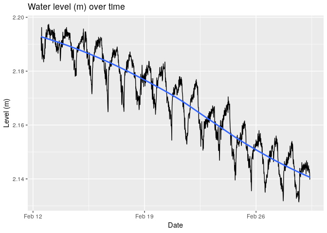

# Devereux Slough ARIMA time series

This project uses a ARIMA time series model with a Fourier Transform to forecast water level for a 
estuary, Deveruex Slough. For more than a year I collected data from loggers 
that I installed around the estuary. Two notebooks are located in the directory
reports. One contains scripts that automate the aggregation and cleaning of datasets
from the loggers. The other notebook explores the time series and creates ARIMA model.

Take aways:

### 1 The Pipeline
We successfully created a data pipeline that recursively checks directories for appropriate data and automatically formats and cleans it. The current method of extracting data from the loggers into seperate directories can be continued, we have just built a pipeline around it.

### 2 The Data
The data captures daily and annual trends that, more importantly, fit what we would expect out of a system like Devereux Slough. Decomposition of the data shows very clear trends and uncorrelated residuals, a positive sign.

### 3 The Model
The model we created works well on a 2 weeks to a month's worth of data. It failed to perform when we incorporated 3 months worth of data into the model. Knowing these limits are useful as it informs us to how best to use this model.

