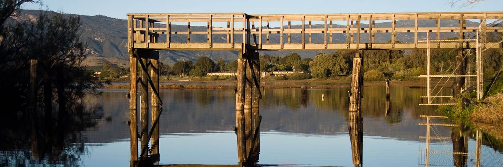

```{r setup, include=FALSE}
knitr::opts_chunk$set(echo = TRUE)
```

# Introduction

Devereux Slough is a estuary in the Santa Barbara County. We developed Water 
Quality and Invertebrate Monitoring Program which collected samples from 
Devereux Slough. Water quality data was captured at regular intervals allowing 
us to build a time series model. This time series model can provide insights on 
how the estuary varies over time, while also predicting how the estuary might 
look in the future.

This project is broken down into the following steps:

1. [Background of Devereux Slough and data](#background)
2. [Normalizing the data](2-Normalizing-the-data)
3. [EDA](#eda)
4. [Creating the model](#model)
5. [Validating the model](#validate)
6. [Forecasting](#forecast)
7. [Conclusion](#analysis)

This model serves several purposes. First, allows the COPR staff to more 
informed management descisions about the reserve and Devereux Slough. Collecting
data and building models should result in better management of the reserve. 
Second, it extends the power of the COPR staff, allowing volunteers to 
contribute in meaningful ways with minimal effort from the COPR staff. Third, it
can contribute to the larger scientific understanding of ecology. There is 
little scientific literature on TOCE in North America, most of the literature 
reflects TOCE in South Africa.

This project outlines a small portion of the Water Quality and Invertebrate 
Monitoring Program carried out by the Santa Barbarba Audubon Society, Coal Oil 
Point Reserve (COPR) and the Cheadle Center for Biodiversity and Ecological 
Restoration. More information about the Santa Barbara Audubon Society can be 
found [here](https://santabarbaraaudubon.org/), as well as COPR which can be 
found [here](https://copr.nrs.ucsb.edu/).

### Technologies and techniques used
Throughout the course of this analysis I've used a number of tools to 
accomplish our goals.

* RMarkdown
* Libraries
    * tidyverse
    * forecast
* Time series
    * ACF and PACF
    * Fourier transform    
    * ARIMA models

# 1 Background {#background}

### Introducion to Devereux Slough

Devereux Slough is a temporary closed/open estuary (TOCE) off of the Santa 
Barbara Channel. It is located within the COPR, a University of California 
Natural Reserve and managed by the University of California, Santa Barbara 
(UCSB). Along with the slough, COPR also manages Sands Beach which sits just 
meters away from Devereux Slough. This is thought to be a major source of water 
for the estury, though this has changed with the connection of Devereux Slough 
to North Campus Open Space (NCOS).


A map of the Devereux Slough and the surrounding area

In general estuaries are 1 of the most productive aquatic systems in the world.
Devereux Slough fits the definition of a temporary closed/open estuary. This
means that for part of the year it is open to inputs of water and  the rest of 
the year it is closed to inputs of water. Inputs of water in this context refers
to bodies of watr and importantly exclude percipitation. For Devereux Slough it 
is closed for most of year, only open when it breaches during the winter, for a 
couple of days. This occurs when Devereux Slough fills up to a critical level 
from winter percipitation that water will flow over the sand berm and into 
Sands Beach, ultimately flowing into the Pacific Ocean. [Videos](https://www.youtube.com/watch?v=DVUcGfp0blE)
of this event show just how violent flowing water can be.

A PhD thesis by Darcy Goodman examined Devereux Slough in a holistic sense, 
especially focussing on the fish diversity and management of the reserve. In 
addition to her thesis, Goodman estiblished a similar monitoring program, 
however that ended a couple years after starting. The lack of long-term 
ecological data is concerning on its own. However, with th recent major changes
in the area, namely the connection of Devereux Slough to NCOS, monitoring 
Devereux Slough becomes more a of a pressing issue. We have already seen impacts 
to Devereux Slough from NCOS.
    

### Collection method
The Pier is one of three sites that we conducted consistently and is the deepest
of all the sites, with consistent depths of over 1.5 meters. Data was collected 
via 4 data loggers deployed off the Pier. The loggers recorded data every 15 
minutes, which amounts to 96 data points per day. We retrieved the data and 
performed maintaince on the loggers every 2 weeks. This took roughly 2 hours,
which explains some of the gaps in the data. 



A gorgeous picture of the Pier. Credits to the Santa Barbara Audubon Society

### Expected trends
Santa Barbara's climate is classified as a Mediterranean climate, characterized
with warm, dry summers and mild winters. Little if any percipitation occurs
outside of winter and annual percipitation is around 0.5 m per year. 
Because of this we can hypothesize some general water level trends. 
We would expect water level to be highest during the winters and decrease 
throughout the years, with the lowest points during the summer months, 
June through August.
    

```{r libraries, message=FALSE, warning=FALSE}
library(tidyverse)
library(here)
library(forecast)
library(tseries)
```

```{r make and move report}
make_md <- function(input_name, output_name) {
  # Moves the knitted md and supporting images from the notebooks dir to reports
  # dir.
  # 
  # Args:
  #   input_name: The name of the knitted md. Typically same as the Rmd title.
  #   output_name: A new name for the md in the reports dir.
  #
  # Output: A new md in the reports dir.
  #
  file.rename(from = here('notebooks', input_name), 
              to = here('reports', output_name))
  
  file.copy(from = list.files(pattern = '*files'), 
            to = here('reports'), recursive = TRUE)
}


make_md('devereux_slough_time_series.md', 'Devereux Slough Time Series.md')
```

# 2 Normalizing the data {#clean}
Reading in a logger dataset that I've been using for testing.
```{r, message=FALSE}
lv <- read_csv(here('data', 'processed', '180301 Level Data.csv'))
head(lv, n=5)
```

Changing the format of the date_time column into a readible format by time 
series functions. We are using the zoo() over other time series functions, like
the standard ts(), because it works well with irregular intervals. 
```{r}
format_df <- function(df, str_var) {
  # Subsets full dataframe to create a dataframe of just a time and variable.
  # Output can be used for time series modelling.
  #
  # Args:
  #   df(Dataframe): A cleaned dataframe with time and water quality parameters
  #   str_var(string): The name of the variable column
  #
  # Returns:
  #   var_df(Dataframe): Returns a dataframe of just time and the inputted 
  #                      variable.
  #
  df$date_time <- as.POSIXct(df$date_time, format = '%m/%d/%y %H:%M')
  var_df <- df[c('date_time',str_var)]
  
  return(var_df)
}

lv_df <- format_df(lv, 'level_m')

cat('Absolute difference in water level over the period of', 
    as.character(min(lv_df$date_time)), 'and', 
    as.character(max(lv_df$date_time)), 'in meters:', 
    max(lv_df$level_m) - min(lv_df$level_m))
```

# 3 EDA {#eda}

Graphing the water level across time we gather a number of important insights
into our data. The first is that the time series is not stationary. A quick look
at the graph and we can conclude that the mean decreases over time. Without 
further testing it is too hard to tell if the variance and covariance vary over
time, but I believe they are relatively constant. If the variance is constant 
than we can perform additive decomposition, this is where the seasonal variation
is constant across time. A additive model is describe as:
$Time series = Seasonal + Trend + Random$

Second, it appears we have some seasonality, on a daily basis. This should be
removed in order to get a accurate depiction of the trend of the series. These 
statistical facts fit the ecological realities of Devereux Slough. Because of 
the very short rainy season, roughly 3 months, in Santa Barbara we would expect 
to see water level decrease in late winter. Additionally, we should expect a 
annual seasonality, meaning that the water level will have a predictable cycle 
over the course of a year. We'll have to factor both the daily and annual 
seasonality into our time series model.

```{r ggplot_trend, warning=FALSE}
ggplot(lv_df, aes(date_time, level_m)) +
    geom_line() +
    geom_smooth(method = 'loess', se = FALSE) +
    xlab('Date') +
    ylab('Level (m)') + 
    ggtitle('Water level (m) over time')
```

This breaks down the data into it's individual components: seasonality, trend 
and the residuals, well irregular components using loess which gives the acronym 
STL. The seasonality seems to be daily and the amplitude does not seem to change,
confirming a constant variance. This means we don't need to transform the 
amplitude, ie take the log. The trend is a relatively constant negative slope 
that occurs over the course of the dataset. The remainder, which are residuals 
from the seasonal plus trend fit, show no distinct pattern and are white noise.
This means that all the data has been extracted from it and we have captured the
entire picture.

While our time series has both daily and annual seasonality, we only run it with
the daily seasonality because we don't have a entire annual seasonal cycle. 
stl() requires a entire cycle.
```{r, fig.width=9, fig.height=5}
decomp_ts <- ts(lv_df$level_m, frequency = 96) %>%
    stl(s.window='periodic') %>%
    plot(main='Decomposition of level_m')
```

Because our decomposition plots show a negative trend we must make the time 
series stationary. This is done by taking the seasonal difference. The ACF and
PACF before and after differencing are shown below. Because each day has 96 
observations, our daily seasonal difference component is lag=96.A plot of the
data after taking the seasonal difference shows that the trend is removed. Even
after taking the seasonal difference there is significant autocorrelation with 
previous points. Now that the trend is removed from the dataset we can move on
with our model.
```{r}
ggtsdisplay(lv_df$level_m, main='ACF and PACF of level_m')

ggtsdisplay(diff(lv_df$level_m, lag=96), main='ACF and PACF of diff(level_m)')
```

A more mathematically rigorous analysis of stationarity is the Augmented Dickey
Fuller (ADF) Test. Running the ADF test on our data with daily seasonality taken
into account gives us a p-value of less than 0.01. Because our p-value < 0.05 we
can reject our $H_0$ that there is a unit root in our time series, and accept 
the $H_1$ that the time series is stationary.
```{r stationarity, warning=FALSE}
lv_adf <- adf.test(lv_df$level_m, k=96)
lv_diff_adf <- adf.test(diff(lv_df$level_m, lag=96), k=96)

cat('p-value from adf.test() of lv_df:', lv_adf$p.value,
    '\np-value from adf.test() of seasonally differenced lv_df:', 
    lv_diff_adf$p.value)
```

# 4 Create the model {#model}

Time series can be approached a number of different ways, however some of the
most common are autoregressive (AR) models, moving average (MA) models and 
autoregressive integrated moving average (ARIMA) models. This analysis will use
an ARIMA model to model our water level time series. AR assumes points depend 
linearly on previous points and thus its formula is very similar to linear 
regression, with a error term. The MA model uses the errors of previous points 
to predict future points. ARIMA model combines both AR and MA models into a 
single model which can often model more complex interactions. The I term is the 
differencing factor. The formula for an ARIMA model is:
$$Y_{t} = c + \phi_{1}y_{dt-1} + \phi_{p}y_{dt-p} + ... + \theta_{1}\epsilon_{t-1} + \theta_{q}\epsilon_{t-q} + \epsilon_{t}$$

The use of a AR model makes sense in modelling water level, where past water 
levels will dictate present and future water levels. The benefits of a MA model
is that it accounts for stochastic events. These events will cause some shift in
the time series and eventually their effect will dispate over time. This is 
extremely useful in modelling natural systems as we have limited, or sometimes 
no, control over the environment. The major benefit of the ARIMA model is that
it allows for modelling of more complex systems.

The Fourier Transform (FT) decomposes a function based on time into the 
frequencies that make it up, using the understanding that all waveforms can be 
drescibed by a sum of sinusoids of different frequencies

The inverse fourier transform that converts a function of frequency into a 
function of time, as follows:
$$f(x) = \int^{\infty}_{-\infty}F(K)e^{2{\pi}ikx}dk$$

We need to use a FT because seasonal versions of ARIMA are not designed to take 
in periods as long as daily, 96, instead seasonal ARIMA periods are typically 
much shorter like monthly, 12, or quarterly, 4. ARIMA implemented in R has a
seasonal period max of 350, but I saw that I was testing the limits of my 16gb
of memory at even 96. Instead we'll use the fourier transformation, this has a
number of advantages:

    * Can use seasonality of any length
    * Can include multiple seasonalities. In this case we can do daily and
      annual
The main disadvantage is that seasonality is assumed to be fixed. In this case 
it is fine, because the variance among days is stable and seasonality is very 
stable, we won't take more than 96 measurements per day and we've accounted for
leap years.

For this project we'll use a multi-seasonal time series (msts) function as our
time series. This allows us to take into account the daily seasonality we've
seen from the plots and the annual seasonality we'd expect to see based on 
meteorological reasoning. Since the loggers take measurements every 15 minutes 
we get our seasonal.period from the following equations:
$$\text{4(measurements per hour) * 24(hours in a day) = 96(measurements per day)}\\
\text{96(measurements per day) * 365.25(days per year) = 35064(measurements per year)}$$

Now that we have normalized our data and have time series object made we create
a model.
```{r}
lv_ts <- msts(lv$level_m, seasonal.periods=c(96,35064))
```

We'll create a function for reproducibility. It performs a grid search of ARIMA
parameters by adjusting the orders of the Fourier term. By comparing the AIC of
different models we can select the model with the largest AIC. 
```{r arima_param}
arima_param <- function(ts){
  # Performs a grid search for optimal ARIMA parameters by comparing aic of
  # each model
  #
  # Args:
  #   ts: A time series object
  # 
  # Return: 
  #    The model and fourier transform with the lowest aicc
  #
  best_fit <- list(model=Inf, aic=Inf, i=Inf, j=Inf)
  
  for (i in 1:10){ #subset: 10, all data: 2
    for (j in 1:5){ #subset:2, all data: 1
      fit <- auto.arima(ts, seasonal=FALSE, xreg=fourier(ts, K=c(i,j)))
      if (fit$aic < best_fit$aic)
        best_fit <- list(model=fit, aicc=fit$aic, i=i, j=j)
      else break;
    }
    
  }
  return(best_fit)
}
```

Running the ARIMA parameter chooser function on our msts dataset. Plotting a
forecast for two days gives us reasonable results. However, we have to validate 
our model in order to trust our forecast.
```{r model}
arima_model <- arima_param(lv_ts)

plotter <- forecast(arima_model$model, 
                    xreg=fourier(lv_ts, K=c(arima_model$i, arima_model$j), 
                                 h=500))
autoplot(plotter)
```

# 5 Validate model {#validate}
checkresiduals() is a nice wrapper function that calls a number of test 
typically used in validating time series models. We'll look at each test 
individually to make sure we can trust our forecasts.

Running a Lijung-Box test helps give us a quantifiable determination if the our
model is valide. The Ljung-Box test examines if there is autocorrelation in the 
series. The $H_0$ of the Box-Ljung test is that the data is independently 
distributed and we do not experience non-random correlation, rejecting the $H_0$
means that serial correlation exist in the data. This is opposite of most 
statistical test, so it's a little weird to think about. Since the 
p-value > 0.05, 0.3545, we fail to reject the $H_0$ and conclude the data is
independently distributed.

The residuals from our model should not exhibit any discernible patterns and 
should be white noise. Additionally, the mean should be 0 and the variance 
constant. Looking at the residual plot we can see that it fullfils all these 
requirements. This is further confirmed by our distribution plot of the 
residuals, which is roughly normally distributed.

The ACF plot shows significant spikes before 100, 200 and 300. Because our
seasonality is 96, we would expect spikes at 96, 192 and 288. Our ACF plot 
follows our expected spikes, though we have some significant spikes when at odd
areas, like 125.
```{r}
checkresiduals(arima_model$model, lag=96)
```

# 6 Forecasting {#forecast}
The daily cycles are due to changes in air temperature and consequently
evaporation. Increased air temperature cause heating of the water which causes
some water molecules to evaporate, decreasing water level.

If we graphed air temperature alongside water level we would expect to see that
the two lines are highly correlate, with the water level cycles closely 
following the air temperature cycles.

Now that we have validate our model we can be assured of the accuracy of our 
predictions. Forecasting two days we can see the same daily seasonality that
occurs in past days. We also see the continuation of the negative trend. The 95%
confidence interval is actually not much larger than the 80% confidence interval.

Because these measurements were taken at the very end of the rainy season we 
would expect the water level to not increase. Additionally, as we approach 
summer we expect to see a continually negative slope as water evaporates from
the lagoon.
```{r}
autoplot(plotter)
```

# 7 Conclusion {#analysis}
Overall I am very satisfied with this model. We can use it for a number of 
things:

1. Most obvious is that we can predict the future water level of Devereux Slough. 
This becomes immensely useful long term as we compare annual cycles of Devereux
Slough against each other and look for anomalies. Measures can be taken by the
reserve staff to prevent anomalies, improving the lagoon.
2. We can compare measured water levels with forecasted water levels. This would 
be a quality of life improvement, providing reassurance that our data loggers
were still functioning correctly.
3. We can refernce forcasted water levels when stochastic events occur. The
model can tell us what the expected water level would be without a event
occuring. Even with the relatively short time that this program has been running 
we have already experience a stochastic event, The fish die-off in early summer 
of 2017.

In addition to water level data we also have salinity, temperature and oxygen 
data. This framework can be expand to our other datasets to create additional 
models, providing a more complete picture of the annual lagoon cycles.


# 8 Bonus
Using the aggregated dataframe we produced from the Data Pipeline and Cleaning 
notebook we can rerun the entire analysis with 3 months of continuous data. 
While the general trend of the forecast fits what we expect, the starting point 
is incorrect. We suspect this is due to the spikes seen around 1.075. In general,
this methodology should be used to create monthly forecast, but further tuning 
would be required to allow the incorporation of more data.
```{r}
complete <- read_csv(here('data', 'processed', 'complete.csv'))

# Format data
complete_ts <- format_df(complete, 'level_m')
complete_ts <- msts(complete_ts$level_m, seasonal.periods=c(96,35064))

# Create arima model
complete_arima_model <- arima_param(complete_ts)

complete_pred <- forecast(complete_arima_model$model, 
                    xreg=fourier(lv_ts, K=c(complete_arima_model$i, 
                                            complete_arima_model$j), 
                                 h=5000))
autoplot(complete_pred)
```


