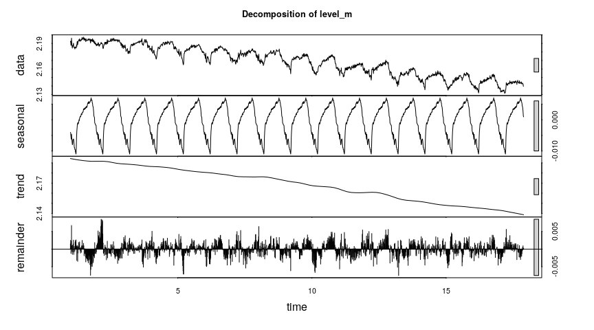
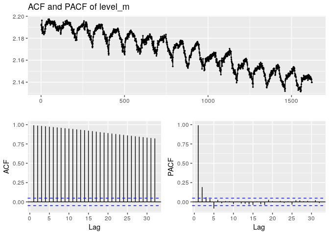
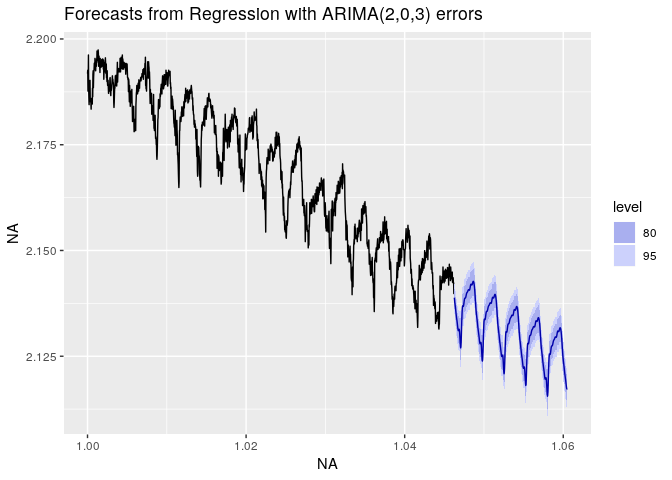

Devereux Slough Time Series
================
Christopher Chan
20:47 26 March 2019

Introduction
============

Devereux Slough is a estuary in the Santa Barbara County. We developed Water Quality and Invertebrate Monitoring Program which collected samples from Devereux Slough. Water quality data was captured at regular intervals allowing us to build a time series model. This time series model can provide insights on how the estuary varies over time, while also predicting how the estuary might look in the future.

This project is broken down into the following steps:

1.  [Background of Devereux Slough and data](#background)
2.  [Normalizing the data](2-Normalizing-the-data)
3.  [EDA](#eda)
4.  [Creating the model](#model)
5.  [Validating the model](#validate)
6.  [Forecasting](#forecast)
7.  [Conclusion](#analysis)

This model serves several purposes. First, allows the COPR staff to more informed management descisions about the reserve and Devereux Slough. Collecting data and building models should result in better management of the reserve. Second, it extends the power of the COPR staff, allowing volunteers to contribute in meaningful ways with minimal effort from the COPR staff. Third, it can contribute to the larger scientific understanding of ecology. There is little scientific literature on TOCE in North America, most of the literature reflects TOCE in South Africa.

This project outlines a small portion of the Water Quality and Invertebrate Monitoring Program carried out by the Santa Barbarba Audubon Society, Coal Oil Point Reserve (COPR) and the Cheadle Center for Biodiversity and Ecological Restoration. More information about the Santa Barbara Audubon Society can be found [here](https://santabarbaraaudubon.org/), as well as COPR which can be found [here](https://copr.nrs.ucsb.edu/).

### Technologies and techniques used

Throughout the course of this analysis I've used a number of tools to accomplish our goals.

-   RMarkdown
-   Libraries
    -   tidyverse
    -   forecast
-   Time series
    -   ACF and PACF
    -   Fourier transform
    -   ARIMA models

1 Background
============

### Introducion to Devereux Slough

Devereux Slough is a temporary closed/open estuary (TOCE) off of the Santa Barbara Channel. It is located within the COPR, a University of California Natural Reserve and managed by the University of California, Santa Barbara (UCSB). Along with the slough, COPR also manages Sands Beach which sits just meters away from Devereux Slough. This is thought to be a major source of water for the estury, though this has changed with the connection of Devereux Slough to North Campus Open Space (NCOS).


A map of the Devereux Slough and the surrounding area

In general estuaries are 1 of the most productive aquatic systems in the world. Devereux Slough fits the definition of a temporary closed/open estuary. This means that for part of the year it is open to inputs of water and the rest of the year it is closed to inputs of water. Inputs of water in this context refers to bodies of watr and importantly exclude percipitation. For Devereux Slough it is closed for most of year, only open when it breaches during the winter, for a couple of days. This occurs when Devereux Slough fills up to a critical level from winter percipitation that water will flow over the sand berm and into Sands Beach, ultimately flowing into the Pacific Ocean. [Videos](https://www.youtube.com/watch?v=DVUcGfp0blE) of this event show just how violent flowing water can be.

A PhD thesis by Darcy Goodman examined Devereux Slough in a holistic sense, especially focussing on the fish diversity and management of the reserve. In addition to her thesis, Goodman estiblished a similar monitoring program, however that ended a couple years after starting. The lack of long-term ecological data is concerning on its own. However, with th recent major changes in the area, namely the connection of Devereux Slough to NCOS, monitoring Devereux Slough becomes more a of a pressing issue. We have already seen impacts to Devereux Slough from NCOS.

### Collection method

The Pier is one of three sites that we conducted consistently and is the deepest of all the sites, with consistent depths of over 1.5 meters. Data was collected via 4 data loggers deployed off the Pier. The loggers recorded data every 15 minutes, which amounts to 96 data points per day. We retrieved the data and performed maintaince on the loggers every 2 weeks. This took roughly 2 hours, which explains some of the gaps in the data.


A gorgeous picture of the Pier. Credits to the Santa Barbara Audubon Society

### Expected trends

Santa Barbara's climate is classified as a Mediterranean climate, characterized with warm, dry summers and mild winters. Little if any percipitation occurs outside of winter and annual percipitation is around 0.5 m per year. Because of this we can hypothesize some general water level trends. We would expect water level to be highest during the winters and decrease throughout the years, with the lowest points during the summer months, June through August.

``` r
library(tidyverse)
library(here)
library(forecast)
library(tseries)
```

``` r
make_md <- function(input_name, output_name) {
  # Moves the knitted md from the notebooks dir to reports dir and deletes 
  # orginal. input_name_files are still located in notebooks dir and are 
  # referenced in the report.md.
  # 
  # Args:
  #   input_name: The name of the knitted md. Typically same as the Rmd title.
  #   output_name: A new name for the md in the reports dir.
  #
  # Output: A new md in the reports dir. 
  file.rename(from = here('notebooks', input_name), to = here('reports', output_name))
}

make_md('devereux_slough_time_series.md', 'devereux_slough_time_series.md')
```

    ## [1] TRUE

2 Normalizing the data
======================

Reading in a logger dataset that I've been using for testing.

``` r
lv <- read_csv(here('data', 'processed', '180301 Level Data.csv'))
head(lv, n=5)
```

    ## # A tibble: 5 x 5
    ##   sample_number date_time      temperature_water sub_pressure level_m
    ##           <dbl> <chr>                      <dbl>        <dbl>   <dbl>
    ## 1             1 02/12/18 12:00              15.9         164.    2.19
    ## 2             2 02/12/18 12:15              15.9         164.    2.19
    ## 3             3 02/12/18 12:30              15.9         164.    2.19
    ## 4             4 02/12/18 12:45              15.9         164.    2.19
    ## 5             5 02/12/18 13:00              15.9         165.    2.20

Changing the format of the date\_time column into a readible format by time series functions. We are using the zoo() over other time series functions, like the standard ts(), because it works well with irregular intervals.

``` r
lv$date_time <- as.POSIXct(lv$date_time, format = '%m/%d/%y %H:%M')
lv_df <- lv[c(2,5)]

cat('Absolute difference in water level over the period of', 
    as.character(min(lv_df$date_time)), 'and', 
    as.character(min(lv_df$date_time)), 'in meters:', 
    max(lv_df$level_m) - min(lv_df$level_m))
```

    ## Absolute difference in water level over the period of 2018-02-12 12:00:00 and 2018-02-12 12:00:00 in meters: 0.06599439

3 EDA
=====

Graphing the water level across time we gather a number of important insights into our data. The first is that the time series is not stationary. A quick look at the graph and we can conclude that the mean decreases over time. Without further testing it is too hard to tell if the variance and covariance vary over time, but I believe they are relatively constant. If the variance is constant than we can perform additive decomposition, this is where the seasonal variation is constant across time. A additive model is describe as: *T**i**m**e**s**e**r**i**e**s* = *S**e**a**s**o**n**a**l* + *T**r**e**n**d* + *R**a**n**d**o**m*

Second, it appears we have some seasonality, on a daily basis. This should be removed in order to get a accurate depiction of the trend of the series. These statistical facts fit the ecological realities of Devereux Slough. Because of the very short rainy season, roughly 3 months, in Santa Barbara we would expect to see water level decrease in late winter. Additionally, we should expect a annual seasonality, meaning that the water level will have a predictable cycle over the course of a year. We'll have to factor both the daily and annual seasonality into our time series model.

``` r
ggplot(lv_df, aes(date_time, level_m)) +
    geom_line() +
    geom_smooth(method = 'loess', se = FALSE) +
    xlab('Date') +
    ylab('Level (m)') + 
    ggtitle('Water level (m) over time')
```



This breaks down the data into it's individual components: seasonality, trend and the residuals, well irregular components using loess which gives the acronym STL. The seasonality seems to be daily and the amplitude does not seem to change, confirming a constant variance. This means we don't need to transform the amplitude, ie take the log. The trend is a relatively constant negative slope that occurs over the course of the dataset. The remainder, which are residuals from the seasonal plus trend fit, show no distinct pattern and are white noise. This means that all the data has been extracted from it and we have captured the entire picture.

While our time series has both daily and annual seasonality, we only run it with the daily seasonality because we don't have a entire annual seasonal cycle. stl() requires a entire cycle.

``` r
decomp_ts <- ts(lv_df$level_m, frequency = 96) %>%
    stl(s.window='periodic') %>%
    plot(main='Decomposition of level_m')
```


Because our decomposition plots show a negative trend we must make the time series stationary. This is done by taking the seasonal difference. The ACF and PACF before and after differencing are shown below. Because each day has 96 observations, our daily seasonal difference component is lag=96.A plot of the data after taking the seasonal difference shows that the trend is removed. Even after taking the seasonal difference there is significant autocorrelation with previous points. Now that the trend is removed from the dataset we can move on with our model.

``` r
ggtsdisplay(lv_df$level_m, main='ACF and PACF of level_m')
```



``` r
ggtsdisplay(diff(lv_df$level_m, lag=96), main='ACF and PACF of diff(level_m)')
```


A more mathematically rigorous analysis of stationarity is the Augmented Dickey Fuller (ADF) Test. Running the ADF test on our data with daily seasonality taken into account gives us a p-value of less than 0.01. Because our p-value &gt; 0.05 we can reject our *H*<sub>0</sub> that there is a unit root in our time series, and accept the *H*<sub>1</sub> that the time series is stationary.

``` r
lv_adf <- adf.test(lv_df$level_m, k=96)
lv_diff_adf <- adf.test(diff(lv_df$level_m, lag=96), k=96)

cat('p-value from adf.test() of lv_df:', lv_adf$p.value,
    '\np-value from adf.test() of seasonally differenced lv_df:', 
    lv_diff_adf$p.value)
```

    ## p-value from adf.test() of lv_df: 0.36561 
    ## p-value from adf.test() of seasonally differenced lv_df: 0.01

4 Create the model
==================

Time series can be approached a number of different ways, however some of the most common are autoregressive (AR) models, moving average (MA) models and autoregressive integrated moving average (ARIMA) models. This analysis will use an ARIMA model to model our water level time series. AR assumes points depend linearly on previous points and thus its formula is very similar to linear regression, with a error term. The MA model uses the errors of previous points to predict future points. ARIMA model combines both AR and MA models into a single model which can often model more complex interactions. The I term is the differencing factor. The formula for an ARIMA model is:
*Y*<sub>*t*</sub> = *c* + *ϕ*<sub>1</sub>*y*<sub>*d**t* − 1</sub> + *ϕ*<sub>*p*</sub>*y*<sub>*d**t* − *p*</sub> + ... + *θ*<sub>1</sub>*ϵ*<sub>*t* − 1</sub> + *θ*<sub>*q*</sub>*ϵ*<sub>*t* − *q*</sub> + *ϵ*<sub>*t*</sub>

The use of a AR model makes sense in modelling water level, where past water levels will dictate present and future water levels. The benefits of a MA model is that it accounts for stochastic events. These events will cause some shift in the time series and eventually their effect will dispate over time. This is extremely useful in modelling natural systems as we have limited, or sometimes no, control over the environment. The major benefit of the ARIMA model is that it allows for modelling of more complex systems.

The Fourier Transform (FT) decomposes a function based on time into the frequencies that make it up, using the understanding that all waveforms can be drescibed by a sum of sinusoids of different frequencies

The inverse fourier transform that converts a function of frequency into a function of time, as follows:
*f*(*x*)=∫<sub>−∞</sub><sup>∞</sup>*F*(*K*)*e*<sup>2*π**i**k**x*</sup>*d**k*

We need to use a FT because seasonal versions of ARIMA are not designed to take in periods as long as daily, 96, instead seasonal ARIMA periods are typically much shorter like monthly, 12, or quarterly, 4. ARIMA implemented in R has a seasonal period max of 350, but I saw that I was testing the limits of my 16gb of memory at even 96. Instead we'll use the fourier transformation, this has a number of advantages:

    * Can use seasonality of any length
    * Can include multiple seasonalities. In this case we can do daily and
      annual

The main disadvantage is that seasonality is assumed to be fixed. In this case it is fine, because the variance among days is stable and seasonality is very stable, we won't take more than 96 measurements per day and we've accounted for leap years.

For this project we'll use a multi-seasonal time series (msts) function as our time series. This allows us to take into account the daily seasonality we've seen from the plots and the annual seasonality we'd expect to see based on meteorological reasoning. Since the loggers take measurements every 15 minutes we get our seasonal.period from the following equations:
$$\\text{4(measurements per hour) \* 24(hours in a day) = 96(measurements per day)}\\\\
\\text{96(measurements per day) \* 365.25(days per year) = 35064(measurements per year)}$$

Now that we have normalized our data and have time series object made we create a model.

``` r
lv_ts <- msts(lv$level_m, seasonal.periods=c(96,35064))
```

We'll create a function for reproducibility. It performs a grid search of ARIMA parameters by adjusting the orders of the Fourier term. By comparing the AIC of different models we can select the model with the largest AIC.

``` r
arima_param <- function(ts){
  # Performs a grid search for optimal ARIMA parameters by comparing aic of
  # each model
  #
  # Args:
  #   ts: A time series object
  # 
  # Return: 
  #    The model and fourier transform with the lowest aicc
  #
  best_fit <- list(model=Inf, aic=Inf, i=Inf, j=Inf)
  
  for (i in 1:2){ #1:10
    for (j in 1:2){ #1:5
      fit <- auto.arima(ts, seasonal=FALSE, xreg=fourier(ts, K=c(i,j)))
      if (fit$aic < best_fit$aic)
        best_fit <- list(model=fit, aicc=fit$aic, i=i, j=j)
      else break;
    }
    
  }
  return(best_fit)
}
```

Running the ARIMA parameter chooser function on our msts dataset. Plotting a forecast for two days gives us reasonable results. However, we have to validate our model in order to trust our forecast.

``` r
arima_model <- arima_param(lv_ts)

plotter <- forecast(arima_model$model, 
                    xreg=fourier(lv_ts, K=c(arima_model$i, arima_model$j), 
                                 h=192))
autoplot(plotter)
```



5 Validate model
================

checkresiduals() is a nice wrapper function that calls a number of test typically used in validating time series models. We'll look at each test individually to make sure we can trust our forecasts.

Running a Lijung-Box test helps give us a quantifiable determination if the our model is valide. The Ljung-Box test examines if there is autocorrelation in the series. The *H*<sub>0</sub> of the Box-Ljung test is that the data is independently distributed and we do not experience non-random correlation, rejecting the *H*<sub>0</sub> means that serial correlation exist in the data. This is opposite of most statistical test, so it's a little weird to think about. Since the p-value &gt; 0.05, 0.3545, we fail to reject the *H*<sub>0</sub> and conclude the data is independently distributed.

The residuals from our model should not exhibit any discernible patterns and should be white noise. Additionally, the mean should be 0 and the variance constant. Looking at the residual plot we can see that it fullfils all these requirements. This is further confirmed by our distribution plot of the residuals, which is roughly normally distributed.

The ACF plot shows significant spikes before 100, 200 and 300. Because our seasonality is 96, we would expect spikes at 96, 192 and 288. Our ACF plot follows our expected spikes, though we have some significant spikes when at odd areas, like 125.

``` r
checkresiduals(arima_model$model, lag=96)
```


    ## 
    ##  Ljung-Box test
    ## 
    ## data:  Residuals from Regression with ARIMA(5,0,1) errors
    ## Q* = 139.72, df = 81, p-value = 5.539e-05
    ## 
    ## Model df: 15.   Total lags used: 96

6 Forecasting
=============

Write more about why daily cycles occur
=======================================

The daily cycles are due to changes in air temperature and consequently evaporation. Increased air temperature cause heating of the water which causes some water moleculse to evaporate.

Evaporation will peak during This process will If we graphed air temperature alongside water level we would expect to see that the two lines are highly correlate, with the water level cycles closely following the air temperature cycles.

Now that we have validate our model we can be assured of the accuracy of our predictions. Forecasting two days we can see the same daily seasonality that occurs in past days. We also see the continuation of the negative trend. The 95% confidence interval is actually not much larger than the 80% confidence interval.

Because these measurements were taken at the very end of the rainy season we would expect the water level to not increase. Additionally, as we approach summer we expect to see a continually negative slope as water evaporates from the lagoon.

``` r
autoplot(plotter)
```


7 Conclusion
============

Overall I am very satisfied with this model. We can use it for a number of things:

1.  Most obvious is that we can predict the future water level of Devereux Slough. This becomes immensely useful long term as we compare annual cycles of Devereux Slough against each other and look for anomalies. Measures can be taken by the reserve staff to prevent anomalies, improving the lagoon.
2.  We can compare measured water levels with forecasted water levels. This would be a quality of life improvement, providing reassurance that our data loggers were still functioning correctly.
3.  We can refernce forcasted water levels when stochastic events occur. The model can tell us what the expected water level would be without a event occuring. Even with the relatively short time that this program has been running we have already experience a stochastic event, The fish die-off in early summer of 2017.

In addition to water level data we also have salinity, temperature and oxygen data. This framework can be expand to our other datasets to create additional models, providing a more complete picture of the annual lagoon cycles.
