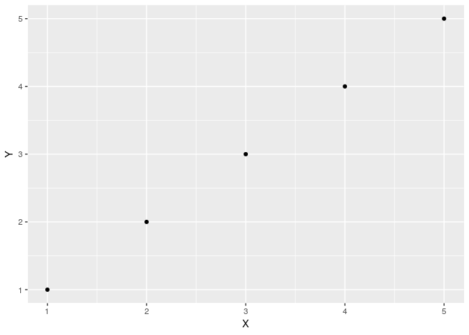

test
================
Christoper Chan
21:06 26 March 2019

``` r
library(tidyverse)
```

    ## ── Attaching packages ────────────────────────────────────────────────────────────────────── tidyverse 1.2.1 ──

    ## ✔ ggplot2 3.1.0       ✔ purrr   0.3.2  
    ## ✔ tibble  2.1.1       ✔ dplyr   0.8.0.1
    ## ✔ tidyr   0.8.3       ✔ stringr 1.4.0  
    ## ✔ readr   1.3.1       ✔ forcats 0.4.0

    ## ── Conflicts ───────────────────────────────────────────────────────────────────────── tidyverse_conflicts() ──
    ## ✖ dplyr::filter() masks stats::filter()
    ## ✖ dplyr::lag()    masks stats::lag()

``` r
library(ggplot2)
library(here)
```

    ## here() starts at /home/ckc/Documents/git_projects/projects/devereux_arima

This correctly makes a md file in the reports.

``` r
make_md <- function(input_name, output_name) {
  # Moves the knitted md from the notebooks dir to reports dir and deletes 
  # orginal. input_name_files are still located in notebooks dir and are 
  # referenced in the report.md.
  # 
  # Args:
  #   input_name: The name of the knitted md. Typically same as the Rmd title.
  #   output_name: A new name for the md in the reports dir.
  #
  # Output: A new md in the reports dir. 
  file.rename(here('notebooks', input_name), here('reports', output_name))
}
```

TO DO:

-   Make md render graphs properly
-   [This](https://deanattali.com/blog/ezknitr-package/) might fix my problems
-   Helpful links:
    -   <https://community.rstudio.com/t/is-it-possible-to-save-the-html-output-in-a-directory-which-is-not-the-one-where-the-rmd-file-resides/3588>
    -   <https://github.com/rstudio/rmarkdown/issues/587>
    -   <https://github.com/yihui/knitr/issues/913>
    -   <https://gist.github.com/jennybc/362f52446fe1ebc4c49f>

``` r
df <- data.frame(X = 1:5, Y = 1:5)
a <- ggplot(df, aes(X, Y)) +
  geom_point()
print(a)
```



``` r
print('hello world')
```

    ## [1] "hello world"

``` r
# knit: (function(input_file, encoding) {
#        rmarkdown::render(input_file, 
#                         encoding = encoding, 
#                         output_file=file.path(dirname(input_file), 'test_dir', 'analysis.md'))
#                         })
```
