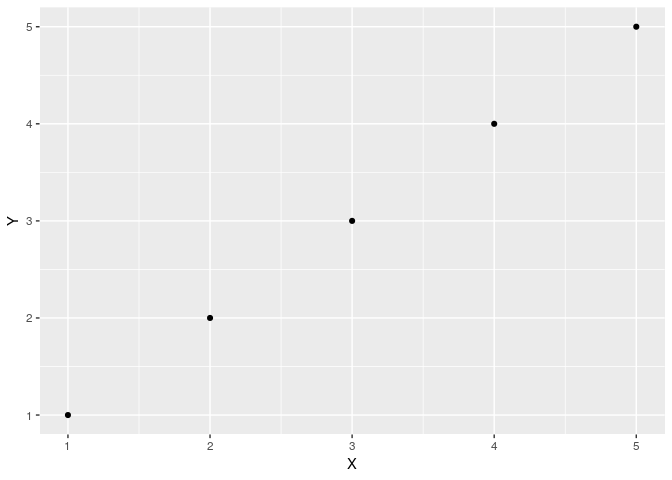

test
================
Christoper Chan
00:03 27 March 2019

``` r
library(tidyverse)
library(ggplot2)
library(here)
```

This correctly makes a md file in the reports.

``` r
make_md <- function(input_name, output_name) {
  # Moves the knitted md and supporting images from the notebooks dir to reports
  # dir. A copy of the md and 
  # 
  # Args:
  #   input_name: The name of the knitted md. Typically same as the Rmd title.
  #   output_name: A new name for the md in the reports dir.
  #
  # Output: A new md in the reports dir. 
  file.rename(from = here('notebooks', input_name), 
              to = here('reports', output_name))
  
  file.copy(from = list.files(pattern = '*files'), 
            to = here('reports'), recursive = TRUE)
}
```

``` r
make_md('test.md', 'test.md')
```

    ## Warning in file.rename(from = here("notebooks", input_name), to =
    ## here("reports", : cannot rename file '/home/ckc/Documents/git_projects/
    ## projects/devereux_arima/notebooks/test.md' to '/home/ckc/Documents/
    ## git_projects/projects/devereux_arima/reports/test.md', reason 'No such file
    ## or directory'

    ## [1] TRUE TRUE

file.rename(here('notebooks', paste(input\_name, 'files', sep = '*')), here('reports', paste(output\_name, 'files', sep = '*')), recursive = TRUE)

TO DO:

-   Make md render graphs properly
-   [This](https://deanattali.com/blog/ezknitr-package/) might fix my problems
-   Helpful links:
    -   <https://community.rstudio.com/t/is-it-possible-to-save-the-html-output-in-a-directory-which-is-not-the-one-where-the-rmd-file-resides/3588>
    -   <https://github.com/rstudio/rmarkdown/issues/587>
    -   <https://github.com/yihui/knitr/issues/913>
    -   <https://gist.github.com/jennybc/362f52446fe1ebc4c49f>

``` r
df <- data.frame(X = 1:5, Y = 1:5)
a <- ggplot(df, aes(X, Y)) +
  geom_point()
print(a)
```



``` r
print('hello world')
```

    ## [1] "hello world"

``` r
# knit: (function(input_file, encoding) {
#        rmarkdown::render(input_file, 
#                         encoding = encoding, 
#                         output_file=file.path(dirname(input_file), 'test_dir', 'analysis.md'))
#                         })
```
