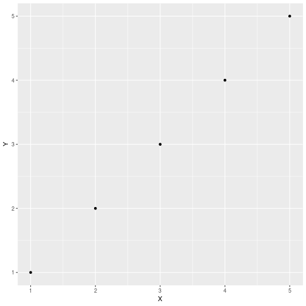

TO DO:

- Make md render graphs properly
  * [This](https://deanattali.com/blog/ezknitr-package/) might fix my problems
  * Helpful links:
    - https://community.rstudio.com/t/is-it-possible-to-save-the-html-output-in-a-directory-which-is-not-the-one-where-the-rmd-file-resides/3588
    - https://github.com/rstudio/rmarkdown/issues/587
    - https://github.com/yihui/knitr/issues/913
    - https://gist.github.com/jennybc/362f52446fe1ebc4c49f


```r
library(tidyverse)
library(ggplot2)
library(here)
```

```r
getwd()
```

```
## [1] "/home/ckc/Documents/git_projects/projects/devereux_arima/notebooks"
```

```r
library(ezknitr)


ezknit(file = here('notebooks', 'test.Rmd'), out_dir = here('reports'))
```

```
## Error in parse_block(g[-1], g[1], params.src): duplicate label 'setup'
```


```r
df <- data.frame(X = 1:5, Y = 1:5)
a <- ggplot(df, aes(X, Y)) +
  geom_point()
print(a)
```




```r
print('hello world')
```

```
## [1] "hello world"
```

```r
# knit: (function(input_file, encoding) {
#        rmarkdown::render(input_file, 
#                         encoding = encoding, 
#                         output_file=file.path(dirname(input_file), 'test_dir', 'analysis.md'))
#                         })
```


