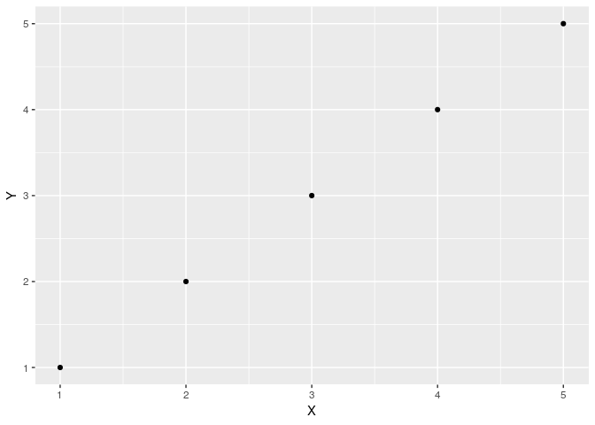

test\_wd
================
Christoper Chan
March 26, 2019

``` r
getwd()
```

    ## [1] "/home/ckc/Documents/git_projects/projects/devereux_arima"

``` r
library(ggplot2)
```

``` r
df <- data.frame(X = 1:5, Y = 1:5)
a <- ggplot(df, aes(X, Y)) +
  geom_point()
print(a)
```



``` r
print('hello world')
```

    ## [1] "hello world"
