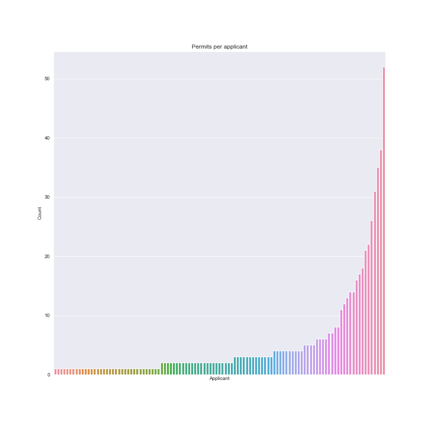

# SF Food Trucks Interactive Map

This project uses open source data from the City of San Francisco. We used Python and Plotly to 
construct a interactive map of all the push carts and food trucks registered with the city. Along 
the way we visualized how and where the licenses were distributed.

Key Take Aways:

## 1 Clusters
There are particular hotspots for push carts and food trucks that in fact differ depending on the 
type of mobile food facility. Push carts are clustered around Union Square and off Market 
Street. Food trucks seem to be concentrated around Financial District and in the Bayview District. 
The driver of clustering is thought to be the density of people.

## 2 The Tip Top
A small minority of vendors seem to hold most of the licenses. The top 10 vendors have 48%
of the permits.

